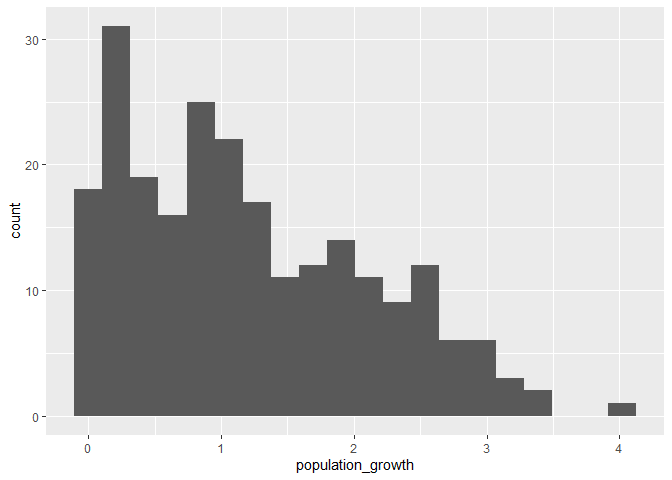
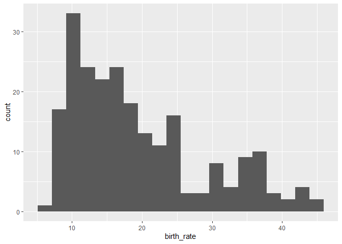
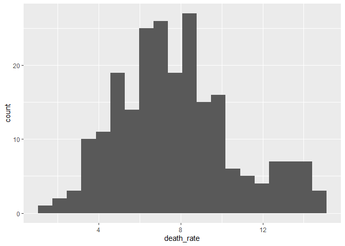

Analyzing CIA Factbook Data Using SQLite and R
================

In this project, we’ll explore the data from [CIA World
Factbook](https://www.cia.gov/the-world-factbook/).

### Exploring the data

To load the packages:

``` r
library(RSQLite)
library(DBI)
```

To connect to the database and view the tables:

``` r
conn <- dbConnect(SQLite(), 'factbook.db')
tables <- dbListTables(conn)
print(tables)
```

    ## [1] "facts"           "sqlite_sequence"

Write an initial query that returns first rows of the `facts` table:

``` r
query <- "SELECT * FROM facts LIMIT 5"
result <- dbGetQuery(conn, query)
print(result)
```

    ##   id code        name    area area_land area_water population
    ## 1  1   af Afghanistan  652230    652230          0   32564342
    ## 2  2   al     Albania   28748     27398       1350    3029278
    ## 3  3   ag     Algeria 2381741   2381741          0   39542166
    ## 4  4   an     Andorra     468       468          0      85580
    ## 5  5   ao      Angola 1246700   1246700          0   19625353
    ##   population_growth birth_rate death_rate migration_rate
    ## 1              2.32      38.57      13.89           1.51
    ## 2              0.30      12.92       6.58           3.30
    ## 3              1.84      23.67       4.31           0.92
    ## 4              0.12       8.13       6.96           0.00
    ## 5              2.78      38.78      11.49           0.46
    ##                   created_at                 updated_at
    ## 1 2015-11-01 13:19:49.461734 2015-11-01 13:19:49.461734
    ## 2 2015-11-01 13:19:54.431082 2015-11-01 13:19:54.431082
    ## 3 2015-11-01 13:19:59.961286 2015-11-01 13:19:59.961286
    ## 4 2015-11-01 13:20:03.659945 2015-11-01 13:20:03.659945
    ## 5 2015-11-01 13:20:08.625072 2015-11-01 13:20:08.625072

Database provides the following information about the countries of the
world:

  - `name` - name of the country
  - `area` - total area of the country (land and water)
  - `area_land` - land area of the country in square km
  - `area_water` - water area of the country in square km
  - `population` - the population of the country
  - `population growth` - population growth of the country in
    percentages
  - `birth_rate` - number of births in a year per 1000 persons
  - `death_rate` - number of deaths in a year per 1000 persons
  - `migration_rate` - the difference between the number of persons
    entering and leaving a country during the year per 1000 persons
    (based on midyear population)

### Summary statistics

To calculate basic summary statistics and check for
outliers:

``` r
query <- "SELECT MIN(population), MAX(population), MIN(population_growth), MAX(population_growth) FROM facts"
result <- dbGetQuery(conn, query)
print(result)
```

    ##   MIN(population) MAX(population) MIN(population_growth)
    ## 1               0      7256490011                      0
    ##   MAX(population_growth)
    ## 1                   4.02

Summary statistics show:

  - a country has population of 0
  - a country has population of 7256490011 (= over 7.2 billion people)

To find these countries:

``` r
query <- "SELECT name FROM facts WHERE population IN (0, 7256490011)"
result <- dbGetQuery(conn, query)
print(result)
```

    ##         name
    ## 1 Antarctica
    ## 2      World

The dataset contains a row for Antarctica with population of 0 and a row
for the whole world (over 7.2 million people).

### Removing outliers

These two outliers will skew visualizations, so we want to exclude them
from the analysis:

``` r
query <- "SELECT * FROM facts WHERE population NOT IN (0, 7256490011)
ORDER BY population"
factbook <- dbGetQuery(conn, query)
```

``` r
dim(factbook)
```

    ## [1] 240  13

To check the
    data:

``` r
head(factbook)
```

    ##    id code                    name area area_land area_water population
    ## 1 238   pc        Pitcairn Islands   47        47          0         48
    ## 2 200   ck Cocos (Keeling) Islands   14        14          0        596
    ## 3 190   vt Holy See (Vatican City)    0         0          0        842
    ## 4 220   ne                    Niue  260       260          0       1190
    ## 5 221   tl                 Tokelau   12        12          0       1337
    ## 6 199   kt        Christmas Island  135       135          0       1530
    ##   population_growth birth_rate death_rate migration_rate
    ## 1              0.00         NA         NA             NA
    ## 2              0.00         NA         NA             NA
    ## 3              0.00         NA         NA             NA
    ## 4              0.03         NA         NA             NA
    ## 5              0.01         NA         NA             NA
    ## 6              1.11         NA         NA             NA
    ##                   created_at                 updated_at
    ## 1 2015-11-01 13:38:08.047849 2015-11-01 13:38:08.047849
    ## 2 2015-11-01 13:36:12.949429 2015-11-01 13:36:12.949429
    ## 3 2015-11-01 13:35:32.774433 2015-11-01 13:35:32.774433
    ## 4 2015-11-01 13:37:15.982898 2015-11-01 13:37:15.982898
    ## 5 2015-11-01 13:37:18.544305 2015-11-01 13:37:18.544305
    ## 6 2015-11-01 13:36:10.549660 2015-11-01 13:36:10.549660

``` r
tail(factbook)
```

    ##      id code           name    area area_land area_water population
    ## 235  24   br         Brazil 8515770   8358140     157630  204259812
    ## 236  78   id      Indonesia 1904569   1811569      93000  255993674
    ## 237 186   us  United States 9826675   9161966     664709  321368864
    ## 238 197   ee European Union 4324782        NA         NA  513949445
    ## 239  77   in          India 3287263   2973193     314070 1251695584
    ## 240  37   ch          China 9596960   9326410     270550 1367485388
    ##     population_growth birth_rate death_rate migration_rate
    ## 235              0.77      14.46       6.58           0.14
    ## 236              0.92      16.72       6.37           1.16
    ## 237              0.78      12.49       8.15           3.86
    ## 238              0.25      10.20      10.20           2.50
    ## 239              1.22      19.55       7.32           0.04
    ## 240              0.45      12.49       7.53           0.44
    ##                     created_at                 updated_at
    ## 235 2015-11-01 13:21:42.799461 2015-11-01 13:21:42.799461
    ## 236 2015-11-01 13:26:30.435758 2015-11-01 13:26:30.435758
    ## 237 2015-11-01 13:35:14.898271 2015-11-01 13:35:14.898271
    ## 238 2015-11-01 13:36:06.493657 2015-11-01 13:36:06.493657
    ## 239 2015-11-01 13:26:24.788193 2015-11-01 13:26:24.788193
    ## 240 2015-11-01 13:22:53.813142 2015-11-01 13:22:53.813142

Two outliers are removed.

### Visualizations

Let’s generate histograms for the following columns:

  - `population`
  - `population_growth`
  - `birth_rate`
  - `death_rate`

<!-- end list -->

``` r
library(ggplot2)
ggplot(data = factbook) +
  aes(x=population) +
  geom_histogram(bins = 20)
```

<!-- -->

The population number distribution is right-skewed with most countries
in the first bin. Very small number of countries has very high
population (close to billion or higher).

``` r
ggplot(data = factbook) +
  aes(x=population_growth) +
  geom_histogram(bins = 20)
```

    ## Warning: Removed 5 rows containing non-finite values (stat_bin).

<!-- -->

The population growth distribution generally shows the decline in number
of countries as the population growth increases.

``` r
ggplot(data = factbook) +
  aes(x=birth_rate) +
  geom_histogram(bins = 20)
```

    ## Warning: Removed 13 rows containing non-finite values (stat_bin).

<!-- -->

The birth rate distribution is right-skewed, with the peak at 10. Birth
rate for most of the countries is between 5 to 25.

``` r
ggplot(data = factbook) +
  aes(x=death_rate) +
  geom_histogram(bins = 20)
```

    ## Warning: Removed 13 rows containing non-finite values (stat_bin).

<!-- -->

The death rate distribution is close to a normal distribution with the
peak around 9 but with another small peak from 13-15.

### Highest population density

To find out which countries have the highest population density (ratio
of population to land
area):

``` r
query <- "SELECT name, CAST(population as Float)/CAST(area_land as Float) as population_density FROM facts ORDER BY population_density DESC LIMIT 10"
result <- dbGetQuery(conn, query)
result
```

    ##          name population_density
    ## 1       Macau          21168.964
    ## 2      Monaco          15267.500
    ## 3   Singapore           8259.785
    ## 4   Hong Kong           6655.271
    ## 5  Gaza Strip           5191.819
    ## 6   Gibraltar           4876.333
    ## 7     Bahrain           1771.859
    ## 8    Maldives           1319.641
    ## 9       Malta           1310.016
    ## 10    Bermuda           1299.926

Top 10 countries with highest population density are: Macau, Monaco,
Singapore, Hong Kong, Gaza Strip, Gibraltar, Baharain, Maldives, Malta
and Bermuda.

To compare our results we can use
[Wikipedia](https://simple.wikipedia.org/wiki/List_of_countries_by_population_density),
where the top 10 countries/dependent territories are: Macau, Monaco,
Singapore, Hong Kong, Gibraltar, Vatican City, Baharain, Malta, Maldives
and Bermuda.

The Wikipedia article also states that the list includes unrecognized
but de facto independent countries (which are not ranked). And the
figures in their table are based on areas including inland water bodies.
Top 10 countries according to Wikipedia are: Monaco, Singapore, Vatican
City, Baharain, Malta, Maldives, Bangladesh, Barbados, Mauritius and
Lebanon.

To check the top 10 if we consider total area of a
country:

``` r
query <- "SELECT name, CAST(population as Float)/CAST(area as Float) as population_density FROM facts ORDER BY population_density DESC LIMIT 10"
result <- dbGetQuery(conn, query)
result
```

    ##          name population_density
    ## 1       Macau          21168.964
    ## 2      Monaco          15267.500
    ## 3   Singapore           8141.280
    ## 4   Hong Kong           6445.042
    ## 5  Gaza Strip           5191.819
    ## 6   Gibraltar           4876.333
    ## 7     Bahrain           1771.859
    ## 8    Maldives           1319.641
    ## 9       Malta           1310.016
    ## 10    Bermuda           1299.926

Top 10 remain the same, in the same order (with a small difference in
population density for Singapore and Hong Kong), so we should use the
total area for comparison.

Additionally, there is no entry for Gaza Strip in the Wikipedia table.

And if we look for Vatican City in the CIA Factbook:

``` r
query <- "SELECT * FROM facts WHERE name LIKE '%Vatican%'"
result <- dbGetQuery(conn, query)
result
```

    ##    id code                    name area area_land area_water population
    ## 1 190   vt Holy See (Vatican City)    0         0          0        842
    ##   population_growth birth_rate death_rate migration_rate
    ## 1                 0         NA         NA             NA
    ##                   created_at                 updated_at
    ## 1 2015-11-01 13:35:32.774433 2015-11-01 13:35:32.774433

Total area for Vatican City is 0.

To compare the data side-by-side for our top 10, we’ll create dataframes
with information from CIA Factbook and from
Wikipedia.

``` r
query <- "SELECT name, CAST(population as Float)/CAST(area as Float) as population_density FROM facts ORDER BY population_density DESC LIMIT 10"
top10 <- dbGetQuery(conn, query)
```

``` r
top10$rank <- c(1,2,3,4,5,6,7,8,9,10)
top10$population_density <- as.integer(top10$population_density)
top10$origin <- "factbook"
top10
```

    ##          name population_density rank   origin
    ## 1       Macau              21168    1 factbook
    ## 2      Monaco              15267    2 factbook
    ## 3   Singapore               8141    3 factbook
    ## 4   Hong Kong               6445    4 factbook
    ## 5  Gaza Strip               5191    5 factbook
    ## 6   Gibraltar               4876    6 factbook
    ## 7     Bahrain               1771    7 factbook
    ## 8    Maldives               1319    8 factbook
    ## 9       Malta               1310    9 factbook
    ## 10    Bermuda               1299   10 factbook

``` r
top10_wiki <- data.frame(name=c("Macau", "Monaco", "Singapore", "Hong Kong", "Gibraltar", "Vatican City", "Bahrain", "Malta", "Maldives","Bermuda"),population_density=c("20286", "18960", "7804", "6765", "4874", "2273", "2013", "1510", "1269","1227"), rank=c(1,2,3,4,5,6,7,8,9,10), origin=c("wiki"), stringsAsFactors=FALSE)
top10_wiki
```

    ##            name population_density rank origin
    ## 1         Macau              20286    1   wiki
    ## 2        Monaco              18960    2   wiki
    ## 3     Singapore               7804    3   wiki
    ## 4     Hong Kong               6765    4   wiki
    ## 5     Gibraltar               4874    5   wiki
    ## 6  Vatican City               2273    6   wiki
    ## 7       Bahrain               2013    7   wiki
    ## 8         Malta               1510    8   wiki
    ## 9      Maldives               1269    9   wiki
    ## 10      Bermuda               1227   10   wiki

``` r
combined <-rbind(top10, top10_wiki)
combined
```

    ##            name population_density rank   origin
    ## 1         Macau              21168    1 factbook
    ## 2        Monaco              15267    2 factbook
    ## 3     Singapore               8141    3 factbook
    ## 4     Hong Kong               6445    4 factbook
    ## 5    Gaza Strip               5191    5 factbook
    ## 6     Gibraltar               4876    6 factbook
    ## 7       Bahrain               1771    7 factbook
    ## 8      Maldives               1319    8 factbook
    ## 9         Malta               1310    9 factbook
    ## 10      Bermuda               1299   10 factbook
    ## 11        Macau              20286    1     wiki
    ## 12       Monaco              18960    2     wiki
    ## 13    Singapore               7804    3     wiki
    ## 14    Hong Kong               6765    4     wiki
    ## 15    Gibraltar               4874    5     wiki
    ## 16 Vatican City               2273    6     wiki
    ## 17      Bahrain               2013    7     wiki
    ## 18        Malta               1510    8     wiki
    ## 19     Maldives               1269    9     wiki
    ## 20      Bermuda               1227   10     wiki

``` r
library(tidyr)
combined2 <- combined %>% pivot_wider(names_from = origin, values_from = c(population_density, rank))
combined2
```

    ## # A tibble: 11 x 5
    ##    name     population_density_~ population_densit~ rank_factbook rank_wiki
    ##    <chr>    <chr>                <chr>                      <dbl>     <dbl>
    ##  1 Macau    21168                20286                          1         1
    ##  2 Monaco   15267                18960                          2         2
    ##  3 Singapo~ 8141                 7804                           3         3
    ##  4 Hong Ko~ 6445                 6765                           4         4
    ##  5 Gaza St~ 5191                 <NA>                           5        NA
    ##  6 Gibralt~ 4876                 4874                           6         5
    ##  7 Bahrain  1771                 2013                           7         7
    ##  8 Maldives 1319                 1269                           8         9
    ##  9 Malta    1310                 1510                           9         8
    ## 10 Bermuda  1299                 1227                          10        10
    ## 11 Vatican~ <NA>                 2273                          NA         6

We see differences between CIA Factbook and Wikipedia data in population
density values and there are small differences in the rank of the
countries that are in top 10 in both sources. The main difference are
the countries that are not in top 10 in both sources.

### Trends for continents

``` r
library(countrycode)
library(dplyr)
```

    ## 
    ## Attaching package: 'dplyr'

    ## The following objects are masked from 'package:stats':
    ## 
    ##     filter, lag

    ## The following objects are masked from 'package:base':
    ## 
    ##     intersect, setdiff, setequal, union

``` r
factbook2 <- factbook

factbook2$continent <- countrycode(sourcevar = factbook2$name,
                            origin = "country.name",
                            destination = "continent")
```

    ## Warning in countrycode(sourcevar = factbook2$name, origin = "country.name", : Some values were not matched unambiguously: Akrotiri, Cocos (Keeling) Islands, Dhekelia, European Union, Kosovo, Saint Martin, Virgin Islands

``` r
head(factbook2)
```

    ##    id code                    name area area_land area_water population
    ## 1 238   pc        Pitcairn Islands   47        47          0         48
    ## 2 200   ck Cocos (Keeling) Islands   14        14          0        596
    ## 3 190   vt Holy See (Vatican City)    0         0          0        842
    ## 4 220   ne                    Niue  260       260          0       1190
    ## 5 221   tl                 Tokelau   12        12          0       1337
    ## 6 199   kt        Christmas Island  135       135          0       1530
    ##   population_growth birth_rate death_rate migration_rate
    ## 1              0.00         NA         NA             NA
    ## 2              0.00         NA         NA             NA
    ## 3              0.00         NA         NA             NA
    ## 4              0.03         NA         NA             NA
    ## 5              0.01         NA         NA             NA
    ## 6              1.11         NA         NA             NA
    ##                   created_at                 updated_at continent
    ## 1 2015-11-01 13:38:08.047849 2015-11-01 13:38:08.047849   Oceania
    ## 2 2015-11-01 13:36:12.949429 2015-11-01 13:36:12.949429      <NA>
    ## 3 2015-11-01 13:35:32.774433 2015-11-01 13:35:32.774433    Europe
    ## 4 2015-11-01 13:37:15.982898 2015-11-01 13:37:15.982898   Oceania
    ## 5 2015-11-01 13:37:18.544305 2015-11-01 13:37:18.544305   Oceania
    ## 6 2015-11-01 13:36:10.549660 2015-11-01 13:36:10.549660   Oceania

``` r
unique(factbook2$continent)
```

    ## [1] "Oceania"  NA         "Europe"   "Americas" "Africa"   "Asia"

We have 5 continents and a group where continent was not assigned.

To check for values that were not matched
unambiguously:

``` r
check_matches <- c("Akrotiri", "Cocos (Keeling) Islands", "Dhekelia", "European Union", "Kosovo", "Saint Martin", "Virgin Islands")
factbook2[factbook2$name %in% check_matches,]
```

    ##      id code                    name    area area_land area_water
    ## 2   200   ck Cocos (Keeling) Islands      14        14          0
    ## 18  225   ax                Akrotiri     123        NA         NA
    ## 19  231   dx                Dhekelia     130        NA         NA
    ## 24  213   rn            Saint Martin      54        54         NA
    ## 46  247   vq          Virgin Islands    1910       346       1564
    ## 90   92   kv                  Kosovo   10887     10887          0
    ## 238 197   ee          European Union 4324782        NA         NA
    ##     population population_growth birth_rate death_rate migration_rate
    ## 2          596              0.00         NA         NA             NA
    ## 18       15700                NA         NA         NA             NA
    ## 19       15700                NA         NA         NA             NA
    ## 24       31754                NA         NA         NA             NA
    ## 46      103574              0.59      10.31       8.54           7.67
    ## 90     1870981                NA         NA         NA             NA
    ## 238  513949445              0.25      10.20      10.20           2.50
    ##                     created_at                 updated_at continent
    ## 2   2015-11-01 13:36:12.949429 2015-11-01 13:36:12.949429      <NA>
    ## 18  2015-11-01 13:37:26.504715 2015-11-01 13:37:26.504715      <NA>
    ## 19  2015-11-01 13:37:45.262682 2015-11-01 13:37:45.262682      <NA>
    ## 24  2015-11-01 13:36:52.134085 2015-11-01 13:36:52.134085      <NA>
    ## 46  2015-11-01 13:38:38.270075 2015-11-01 13:38:38.270075      <NA>
    ## 90  2015-11-01 13:27:43.834473 2015-11-01 13:27:43.834473      <NA>
    ## 238 2015-11-01 13:36:06.493657 2015-11-01 13:36:06.493657      <NA>

Only two country entries, from those not matched unambiguously, have
values for birth rate and death rate: Virgin Island and European Union.

The EU member states are already in our
data:

``` r
eu <- c("Austria", "Belgium", "Bulgaria", "Croatia", "Cyprus", "Czech Republic", "Denmark", "Estonia", "Finland", "France", "Germany", "Greece", "Hungary", "Ireland", "Italy", "Latvia", "Lithuania", "Luxembourg", "Malta", "Netherlands", "Poland", "Portugal", "Romania", "Slovakia", "Slovenia", "Spain", "Sweden", "United Kingdom")
factbook2[factbook2$name %in% eu,]
```

    ##      id code           name   area area_land area_water population
    ## 65  110   mt          Malta    316       316          0     413965
    ## 68  103   lu     Luxembourg   2586      2586          0     570252
    ## 80   46   cy         Cyprus   9251      9241         10    1189197
    ## 83   57   en        Estonia  45228     42388       2840    1265420
    ## 93  158   si       Slovenia  20273     20151        122    1983412
    ## 94   96   lg         Latvia  64589     62249       2340    1986705
    ## 101 102   lh      Lithuania  65300     62680       2620    2884433
    ## 115  44   hr        Croatia  56594     55974        620    4464844
    ## 118  81   ei        Ireland  70273     68883       1390    4892305
    ## 123 157   lo       Slovakia  49035     48105        930    5445027
    ## 124  60   fi        Finland 338145    303815      34330    5476922
    ## 125  48   da        Denmark  43094     42434        660    5581503
    ## 140  26   bu       Bulgaria 110879    108489       2390    7186893
    ## 146  10   au        Austria  83871     82445       1426    8665550
    ## 150 168   sw         Sweden 450295    410335      39960    9801616
    ## 151  75   hu        Hungary  93028     89608       3420    9897541
    ## 156  47   ez Czech Republic  78867     77247       1620   10644842
    ## 158  67   gr         Greece 131957    130647       1310   10775643
    ## 160 140   po       Portugal  92090     91470        620   10825309
    ## 163  17   be        Belgium  30528     30278        250   11323973
    ## 174 125   nl    Netherlands  41543     33893       7650   16947904
    ## 183 142   ro        Romania 238391    229891       8500   21666350
    ## 206 139   pl         Poland 312685    304255       8430   38562189
    ## 212 163   sp          Spain 505370    498980       6390   48146134
    ## 217  83   it          Italy 301340    294140       7200   61855120
    ## 218 185   uk United Kingdom 243610    241930       1680   64088222
    ## 219  61   fr         France 643801    640427       3374   66553766
    ## 223  65   gm        Germany 357022    348672       8350   80854408
    ##     population_growth birth_rate death_rate migration_rate
    ## 65               0.31      10.18       9.09           1.98
    ## 68               2.13      11.37       7.24          17.16
    ## 80               1.43      11.41       6.62           9.48
    ## 83               0.55      10.51      12.40           3.60
    ## 93               0.26       8.42      11.37           0.37
    ## 94               1.06      10.00      14.31           6.26
    ## 101              1.04      10.10      14.27           6.27
    ## 115              0.13       9.45      12.18           1.39
    ## 118              1.25      14.84       6.48           4.09
    ## 123              0.02       9.91       9.74           0.04
    ## 124              0.40      10.72       9.83           3.10
    ## 125              0.22      10.27      10.25           2.20
    ## 140              0.58       8.92      14.44           0.29
    ## 146              0.55       9.41       9.42           5.56
    ## 150              0.80      11.99       9.40           5.42
    ## 151              0.22       9.16      12.73           1.33
    ## 156              0.16       9.63      10.34           2.33
    ## 158              0.01       8.66      11.09           2.32
    ## 160              0.09       9.27      11.02           2.67
    ## 163              0.76      11.41       9.63           5.87
    ## 174              0.41      10.83       8.66           1.95
    ## 183              0.30       9.14      11.90           0.24
    ## 206              0.09       9.74      10.19           0.46
    ## 212              0.89       9.64       9.04           8.31
    ## 217              0.27       8.74      10.19           4.10
    ## 218              0.54      12.17       9.35           2.54
    ## 219              0.43      12.38       9.16           1.09
    ## 223              0.17       8.47      11.42           1.24
    ##                     created_at                 updated_at continent
    ## 65  2015-11-01 13:29:10.056831 2015-11-01 13:29:10.056831    Europe
    ## 68  2015-11-01 13:28:35.879147 2015-11-01 13:28:35.879147    Europe
    ## 80  2015-11-01 13:23:43.214032 2015-11-01 13:23:43.214032      Asia
    ## 83  2015-11-01 13:24:39.348509 2015-11-01 13:24:39.348509    Europe
    ## 93  2015-11-01 13:32:58.683900 2015-11-01 13:32:58.683900    Europe
    ## 94  2015-11-01 13:28:02.736587 2015-11-01 13:28:02.736587    Europe
    ## 101 2015-11-01 13:28:31.246995 2015-11-01 13:28:31.246995    Europe
    ## 115 2015-11-01 13:23:31.420107 2015-11-01 13:23:31.420107    Europe
    ## 118 2015-11-01 13:26:46.857349 2015-11-01 13:26:46.857349    Europe
    ## 123 2015-11-01 13:32:53.821199 2015-11-01 13:32:53.821199    Europe
    ## 124 2015-11-01 13:24:54.260412 2015-11-01 13:24:54.260412    Europe
    ## 125 2015-11-01 13:23:53.727410 2015-11-01 13:23:53.727410    Europe
    ## 140 2015-11-01 13:21:52.018824 2015-11-01 13:21:52.018824    Europe
    ## 146 2015-11-01 13:20:33.093597 2015-11-01 13:20:33.093597    Europe
    ## 150 2015-11-01 13:33:45.540276 2015-11-01 13:33:45.540276    Europe
    ## 151 2015-11-01 13:26:14.152686 2015-11-01 13:26:14.152686    Europe
    ## 156 2015-11-01 13:23:48.556068 2015-11-01 13:23:48.556068    Europe
    ## 158 2015-11-01 13:25:32.471183 2015-11-01 13:25:32.471183    Europe
    ## 160 2015-11-01 13:31:34.123130 2015-11-01 13:31:34.123130    Europe
    ## 163 2015-11-01 13:21:07.317024 2015-11-01 13:21:07.317024    Europe
    ## 174 2015-11-01 13:30:20.205904 2015-11-01 13:30:20.205904    Europe
    ## 183 2015-11-01 13:31:43.927783 2015-11-01 13:31:43.927783    Europe
    ## 206 2015-11-01 13:31:29.189900 2015-11-01 13:31:29.189900    Europe
    ## 212 2015-11-01 13:33:21.563195 2015-11-01 13:33:21.563195    Europe
    ## 217 2015-11-01 13:26:58.014646 2015-11-01 13:26:58.014646    Europe
    ## 218 2015-11-01 13:35:09.362933 2015-11-01 13:35:09.362933    Europe
    ## 219 2015-11-01 13:25:00.853401 2015-11-01 13:25:00.853401    Europe
    ## 223 2015-11-01 13:25:21.942190 2015-11-01 13:25:21.942190    Europe

So we can remove the EU row:

``` r
factbook2 <- factbook2 %>% filter(factbook2$name!="European Union")
```

If we check the CIA Factbook website, we find that Virgin Islands are in
the Carribean Sea, so we can assign Americas as the continent:

``` r
factbook2[factbook2$name=="Virgin Islands", "continent"] <- "Americas"
factbook2[factbook2$name=="Virgin Islands",]
```

    ##     id code           name area area_land area_water population
    ## 46 247   vq Virgin Islands 1910       346       1564     103574
    ##    population_growth birth_rate death_rate migration_rate
    ## 46              0.59      10.31       8.54           7.67
    ##                    created_at                 updated_at continent
    ## 46 2015-11-01 13:38:38.270075 2015-11-01 13:38:38.270075  Americas

To check for missing
    data:

``` r
colSums(is.na(factbook2))
```

    ##                id              code              name              area 
    ##                 0                 0                 0                 3 
    ##         area_land        area_water        population population_growth 
    ##                 6                 8                 0                 5 
    ##        birth_rate        death_rate    migration_rate        created_at 
    ##                13                13                17                 0 
    ##        updated_at         continent 
    ##                 0                 5

To remove the entries with unassigned continent:

``` r
factbook2 <- factbook2 %>% filter(!is.na(factbook2$continent))
head(factbook2)
```

    ##    id code                    name  area area_land area_water population
    ## 1 238   pc        Pitcairn Islands    47        47          0         48
    ## 2 190   vt Holy See (Vatican City)     0         0          0        842
    ## 3 220   ne                    Niue   260       260          0       1190
    ## 4 221   tl                 Tokelau    12        12          0       1337
    ## 5 199   kt        Christmas Island   135       135          0       1530
    ## 6 224   sv                Svalbard 62045     62045          0       1872
    ##   population_growth birth_rate death_rate migration_rate
    ## 1              0.00         NA         NA             NA
    ## 2              0.00         NA         NA             NA
    ## 3              0.03         NA         NA             NA
    ## 4              0.01         NA         NA             NA
    ## 5              1.11         NA         NA             NA
    ## 6              0.03         NA         NA             NA
    ##                   created_at                 updated_at continent
    ## 1 2015-11-01 13:38:08.047849 2015-11-01 13:38:08.047849   Oceania
    ## 2 2015-11-01 13:35:32.774433 2015-11-01 13:35:32.774433    Europe
    ## 3 2015-11-01 13:37:15.982898 2015-11-01 13:37:15.982898   Oceania
    ## 4 2015-11-01 13:37:18.544305 2015-11-01 13:37:18.544305   Oceania
    ## 5 2015-11-01 13:36:10.549660 2015-11-01 13:36:10.549660   Oceania
    ## 6 2015-11-01 13:37:24.335698 2015-11-01 13:37:24.335698    Europe

The number of countries we have per continent:

``` r
factbook2 %>% 
  group_by(continent) %>%
  summarise(no_of_countries=n())
```

    ## # A tibble: 5 x 2
    ##   continent no_of_countries
    ##   <chr>               <int>
    ## 1 Africa                 56
    ## 2 Americas               50
    ## 3 Asia                   52
    ## 4 Europe                 50
    ## 5 Oceania                26

To find the rate trends by continent (excluding the missing values):

``` r
continents <- factbook2 %>%
  group_by(continent) %>%
  summarize(birth_rate=mean(birth_rate, na.rm=TRUE), death_rate=mean(death_rate, na.rm=TRUE), difference = (mean(birth_rate, na.rm=TRUE)-mean(death_rate, na.rm=TRUE)), population_growth=mean(population_growth, na.rm=TRUE))
continents
```

    ## # A tibble: 5 x 5
    ##   continent birth_rate death_rate difference population_growth
    ##   <chr>          <dbl>      <dbl>      <dbl>             <dbl>
    ## 1 Africa          31.3       9.42     21.8               2.14 
    ## 2 Americas        15.3       6.57      8.74              0.946
    ## 3 Asia            18.6       5.95     12.6               1.30 
    ## 4 Europe          10.5      10.1       0.389             0.493
    ## 5 Oceania         19.4       5.74     13.7               0.912

The difference between birth rate and death rate is highest in Africa
and lowest in Europe. The difference in Africa is almost double than the
difference in Asia or Oceania, almost triple than in Americas and
approximately 55 times higher than in Europe.

Continents rank the same (Africa, Oceania, Asia, Americas, Europe)
regarding the population growth, but population growth also takes
immigration and emigration into account.

To disconnect from the database:

``` r
dbDisconnect(conn)
```
