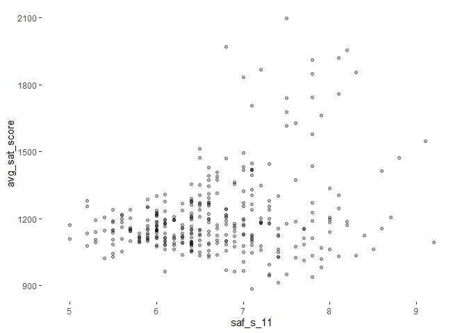

Exploring NYC Schools Survey Data
================

In this project the data from the New York City Department of Education
will be analyzed to understand whether parent, teacher and student
perceptions of safety, engagement, communication and academics relate to
average school SAT scores.

The data, collected in 2011 and publicly available, can be accessed
[here](https://data.cityofnewyork.us/Education/2011-NYC-School-Survey/mnz3-dyi8).

The “combined.csv” file is provided by
[Dataquest](https://www.dataquest.io/).

To load the needed packages:

``` r
library(readr)
library(dplyr)
```

    ## 
    ## Attaching package: 'dplyr'

    ## The following objects are masked from 'package:stats':
    ## 
    ##     filter, lag

    ## The following objects are masked from 'package:base':
    ## 
    ##     intersect, setdiff, setequal, union

``` r
library(stringr)
library(purrr)
library(tidyr)
library(ggplot2)
```

According to the data dictionary (`Survey Data Dictionary.xls`), the
school-level data is available for general education schools (file name:
`masterfile11_gened_final.txt`) and for special education District 75
schools (file name: `masterfile11_D75_final.txt`). These files display
one line of information for each school (by DBN), that includes the
response rate for each school, the number of surveys submitted, the size
of the eligible survey population at each school, question scores, the
percentage of responses selected and the count of responses selected.

### Exploring the data

To import the data:

``` r
combined <- read_csv("combined.csv")
```

    ## Parsed with column specification:
    ## cols(
    ##   .default = col_double(),
    ##   DBN = col_character(),
    ##   school_name = col_character(),
    ##   boro = col_character()
    ## )

    ## See spec(...) for full column specifications.

``` r
gened <- read_tsv("masterfile11_gened_final.txt")
```

    ## Parsed with column specification:
    ## cols(
    ##   .default = col_double(),
    ##   dbn = col_character(),
    ##   bn = col_character(),
    ##   schoolname = col_character(),
    ##   studentssurveyed = col_character(),
    ##   schooltype = col_character(),
    ##   p_q1 = col_logical(),
    ##   p_q3d = col_logical(),
    ##   p_q9 = col_logical(),
    ##   p_q10 = col_logical(),
    ##   p_q12aa = col_logical(),
    ##   p_q12ab = col_logical(),
    ##   p_q12ac = col_logical(),
    ##   p_q12ad = col_logical(),
    ##   p_q12ba = col_logical(),
    ##   p_q12bb = col_logical(),
    ##   p_q12bc = col_logical(),
    ##   p_q12bd = col_logical(),
    ##   t_q6m = col_logical(),
    ##   t_q9 = col_logical(),
    ##   t_q10a = col_logical()
    ##   # ... with 18 more columns
    ## )
    ## See spec(...) for full column specifications.

``` r
d75 <- read_tsv("masterfile11_d75_final.txt")
```

    ## Parsed with column specification:
    ## cols(
    ##   .default = col_double(),
    ##   dbn = col_character(),
    ##   bn = col_character(),
    ##   schoolname = col_character(),
    ##   studentssurveyed = col_character(),
    ##   schooltype = col_character(),
    ##   p_q5 = col_logical(),
    ##   p_q9 = col_logical(),
    ##   p_q13a = col_logical(),
    ##   p_q13b = col_logical(),
    ##   p_q13c = col_logical(),
    ##   p_q13d = col_logical(),
    ##   p_q14a = col_logical(),
    ##   p_q14b = col_logical(),
    ##   p_q14c = col_logical(),
    ##   p_q14d = col_logical(),
    ##   t_q11a = col_logical(),
    ##   t_q11b = col_logical(),
    ##   t_q14 = col_logical(),
    ##   t_q15a = col_logical(),
    ##   t_q15b = col_logical()
    ##   # ... with 14 more columns
    ## )
    ## See spec(...) for full column specifications.

Preview of the data:

``` r
head(combined)
```

    ## # A tibble: 6 x 30
    ##   DBN   school_name `Num of SAT Tes~ `SAT Critical R~ `SAT Math Avg. ~
    ##   <chr> <chr>                  <dbl>            <dbl>            <dbl>
    ## 1 01M2~ HENRY STRE~               29              355              404
    ## 2 01M4~ UNIVERSITY~               91              383              423
    ## 3 01M4~ EAST SIDE ~               70              377              402
    ## 4 01M4~ FORSYTH SA~                7              414              401
    ## 5 01M5~ MARTA VALL~               44              390              433
    ## 6 01M5~ LOWER EAST~              112              332              557
    ## # ... with 25 more variables: `SAT Writing Avg. Score` <dbl>,
    ## #   avg_sat_score <dbl>, `AP Test Takers` <dbl>, `Total Exams
    ## #   Taken` <dbl>, `Number of Exams with scores 3 4 or 5` <dbl>,
    ## #   exams_per_student <dbl>, high_score_percent <dbl>,
    ## #   avg_class_size <dbl>, frl_percent <dbl>, total_enrollment <dbl>,
    ## #   ell_percent <dbl>, sped_percent <dbl>, selfcontained_num <dbl>,
    ## #   asian_per <dbl>, black_per <dbl>, hispanic_per <dbl>, white_per <dbl>,
    ## #   male_per <dbl>, female_per <dbl>, `Total Cohort` <dbl>,
    ## #   grads_percent <dbl>, dropout_percent <dbl>, boro <chr>, lat <dbl>,
    ## #   long <dbl>

``` r
dim(combined)
```

    ## [1] 479  30

``` r
head(gened)
```

    ## # A tibble: 6 x 1,942
    ##   dbn   bn    schoolname   d75 studentssurveyed highschool schooltype  rr_s
    ##   <chr> <chr> <chr>      <dbl> <chr>                 <dbl> <chr>      <dbl>
    ## 1 01M0~ M015  P.S. 015 ~     0 No                        0 Elementar~    NA
    ## 2 01M0~ M019  P.S. 019 ~     0 No                        0 Elementar~    NA
    ## 3 01M0~ M020  P.S. 020 ~     0 No                        0 Elementar~    NA
    ## 4 01M0~ M034  P.S. 034 ~     0 Yes                       0 Elementar~    89
    ## 5 01M0~ M063  P.S. 063 ~     0 No                        0 Elementar~    NA
    ## 6 01M0~ M064  P.S. 064 ~     0 No                        0 Elementar~    NA
    ## # ... with 1,934 more variables: rr_t <dbl>, rr_p <dbl>, N_s <dbl>,
    ## #   N_t <dbl>, N_p <dbl>, nr_s <dbl>, nr_t <dbl>, nr_p <dbl>,
    ## #   saf_p_11 <dbl>, com_p_11 <dbl>, eng_p_11 <dbl>, aca_p_11 <dbl>,
    ## #   saf_t_11 <dbl>, com_t_11 <dbl>, eng_t_11 <dbl>, aca_t_11 <dbl>,
    ## #   saf_s_11 <dbl>, com_s_11 <dbl>, eng_s_11 <dbl>, aca_s_11 <dbl>,
    ## #   saf_tot_11 <dbl>, com_tot_11 <dbl>, eng_tot_11 <dbl>,
    ## #   aca_tot_11 <dbl>, p_q2h <dbl>, p_q7a <dbl>, p_q7b <dbl>, p_q7c <dbl>,
    ## #   p_q7d <dbl>, p_q8a <dbl>, p_q8b <dbl>, p_q8c <dbl>, p_q8d <dbl>,
    ## #   p_q8e <dbl>, p_q8f <dbl>, p_q2b <dbl>, p_q2d <dbl>, p_q2e <dbl>,
    ## #   p_q2f <dbl>, p_q2g <dbl>, p_q3a <dbl>, p_q3b <dbl>, p_q4b <dbl>,
    ## #   p_q4c <dbl>, p_q11c <dbl>, p_q2a <dbl>, p_q2c <dbl>, p_q3c <dbl>,
    ## #   p_q6a <dbl>, p_q6b <dbl>, p_q11d <dbl>, p_q11e <dbl>, p_q5 <dbl>,
    ## #   p_q4a <dbl>, p_q4d <dbl>, p_q4e <dbl>, p_q11a <dbl>, p_q11b <dbl>,
    ## #   p_q11f <dbl>, p_q1 <lgl>, p_q3d <lgl>, p_q9 <lgl>, p_q10 <lgl>,
    ## #   p_q12aa <lgl>, p_q12ab <lgl>, p_q12ac <lgl>, p_q12ad <lgl>,
    ## #   p_q12ba <lgl>, p_q12bb <lgl>, p_q12bc <lgl>, p_q12bd <lgl>,
    ## #   p_q1_1 <dbl>, p_q1_2 <dbl>, p_q1_3 <dbl>, p_q1_4 <dbl>, p_q1_5 <dbl>,
    ## #   p_q1_6 <dbl>, p_q1_7 <dbl>, p_q1_8 <dbl>, p_q1_9 <dbl>, p_q1_10 <dbl>,
    ## #   p_q1_11 <dbl>, p_q1_12 <dbl>, p_q1_13 <dbl>, p_q1_14 <dbl>,
    ## #   p_q2a_1 <dbl>, p_q2a_2 <dbl>, p_q2a_3 <dbl>, p_q2a_4 <dbl>,
    ## #   p_q2a_5 <dbl>, p_q2b_1 <dbl>, p_q2b_2 <dbl>, p_q2b_3 <dbl>,
    ## #   p_q2b_4 <dbl>, p_q2b_5 <dbl>, p_q2c_1 <dbl>, p_q2c_2 <dbl>,
    ## #   p_q2c_3 <dbl>, p_q2c_4 <dbl>, p_q2c_5 <dbl>, ...

``` r
dim(gened)
```

    ## [1] 1646 1942

``` r
head(d75)
```

    ## # A tibble: 6 x 1,773
    ##   dbn   bn    schoolname   d75 studentssurveyed highschool schooltype  rr_s
    ##   <chr> <chr> <chr>      <dbl> <chr>                 <dbl> <chr>      <dbl>
    ## 1 75K0~ K004  P.S. K004      1 Yes                       0 District ~    38
    ## 2 75K0~ K036  P.S. 36        1 Yes                      NA District ~    70
    ## 3 75K0~ K053  P.S. K053      1 Yes                      NA District ~    94
    ## 4 75K0~ K077  P.S. K077      1 Yes                      NA District ~    95
    ## 5 75K1~ K140  P.S. K140      1 Yes                       0 District ~    77
    ## 6 75K1~ K141  P.S. K141      1 Yes                      NA District ~    73
    ## # ... with 1,765 more variables: rr_t <dbl>, rr_p <dbl>, N_s <dbl>,
    ## #   N_t <dbl>, N_p <dbl>, nr_s <dbl>, nr_t <dbl>, nr_p <dbl>,
    ## #   saf_p_11 <dbl>, com_p_11 <dbl>, eng_p_11 <dbl>, aca_p_11 <dbl>,
    ## #   saf_t_11 <dbl>, com_t_11 <dbl>, eng_t_11 <dbl>, aca_t_11 <dbl>,
    ## #   saf_s_11 <dbl>, com_s_11 <dbl>, eng_s_11 <dbl>, aca_s_11 <dbl>,
    ## #   saf_tot_11 <dbl>, com_tot_11 <dbl>, eng_tot_11 <dbl>,
    ## #   aca_tot_11 <dbl>, p_q1c <dbl>, p_q10a <dbl>, p_q10b <dbl>,
    ## #   p_q10c <dbl>, p_q10d <dbl>, p_q10e <dbl>, p_q10f <dbl>, p_q11a <dbl>,
    ## #   p_q11b <dbl>, p_q11c <dbl>, p_q11d <dbl>, p_q11e <dbl>, p_q1b <dbl>,
    ## #   p_q1e <dbl>, p_q1f <dbl>, p_q2a <dbl>, p_q2b <dbl>, p_q3c <dbl>,
    ## #   p_q3d <dbl>, p_q4a <dbl>, p_q6c <dbl>, p_q12c <dbl>, p_q1a <dbl>,
    ## #   p_q1d <dbl>, p_q3a <dbl>, p_q3b <dbl>, p_q3e <dbl>, p_q4b <dbl>,
    ## #   p_q4c <dbl>, p_q6e <dbl>, p_q7 <dbl>, p_q8a <dbl>, p_q8b <dbl>,
    ## #   p_q12d <dbl>, p_q1g <dbl>, p_q6a <dbl>, p_q6b <dbl>, p_q6d <dbl>,
    ## #   p_q6f <dbl>, p_q6g <dbl>, p_q6h <dbl>, p_q12a <dbl>, p_q12b <dbl>,
    ## #   p_q12e <dbl>, p_q12f <dbl>, p_q5 <lgl>, p_q9 <lgl>, p_q13a <lgl>,
    ## #   p_q13b <lgl>, p_q13c <lgl>, p_q13d <lgl>, p_q14a <lgl>, p_q14b <lgl>,
    ## #   p_q14c <lgl>, p_q14d <lgl>, p_q1a_1 <dbl>, p_q1a_2 <dbl>,
    ## #   p_q1a_3 <dbl>, p_q1a_4 <dbl>, p_q1a_5 <dbl>, p_q1b_1 <dbl>,
    ## #   p_q1b_2 <dbl>, p_q1b_3 <dbl>, p_q1b_4 <dbl>, p_q1b_5 <dbl>,
    ## #   p_q1c_1 <dbl>, p_q1c_2 <dbl>, p_q1c_3 <dbl>, p_q1c_4 <dbl>,
    ## #   p_q1c_5 <dbl>, p_q1d_1 <dbl>, p_q1d_2 <dbl>, p_q1d_3 <dbl>,
    ## #   p_q1d_4 <dbl>, p_q1d_5 <dbl>, p_q1e_1 <dbl>, ...

``` r
dim(d75)
```

    ## [1]   56 1773

The dataframes contain a significant number of rows and columns.

Data dictionary shows that most of the variable columns provide granular
information about survey responses. For example, the variable `s_q1a_1`
contains the number of students (indicated by “s”) that responded to
“option 1” of “question 1a.” Since we want to study the link between
perceptions of school quality and SAT scores, we should focus on
aggregate scores for each school.

We should also note that variables in data dictionary end with `_10`,
while in our dataframes they end with `_11` (which presumably denotes
years 2010 and 2011.)

The variable names we are interested in (with aggregate scores) refer to
schools’ scores as determined by different groups’ survey responses:

1.  metrics in the survey:

<!-- end list -->

  - Safety and Respect - saf
  - Communication - com
  - Engagement - eng
  - Academic Expectations - aca

<!-- end list -->

2.  groups in the survey:

<!-- end list -->

  - Parents - p
  - Teachers - t
  - Students - s
  - Total (average of parent, teacher and student scores) - tot

We can include variables starting with `dbn` (first column) and ending
with `aca_tot_11` (last column with aggregate scores).

Since we are interested in SAT scores, we should focus on high schools.
The type of schools in our data
    frames:

``` r
unique(gened$schooltype)
```

    ## [1] "Elementary School"                 "Elementary / Middle School"       
    ## [3] "Middle / High School"              "Middle School"                    
    ## [5] "High School"                       "Elementary / Middle / High School"
    ## [7] "Early Childhood School"            "YABC"

``` r
unique(d75$schooltype)
```

    ## [1] "District 75 Special Education"

``` r
unique(d75$highschool)
```

    ## [1]  0 NA

### Simplifying dataframes

To filter the data to include only high schools (where applicable) and
select columns we need:

``` r
survey_gened <- gened %>%
  filter(schooltype == "High School") %>%
  select(dbn:aca_tot_11)
```

``` r
head(survey_gened)
```

    ## # A tibble: 6 x 32
    ##   dbn   bn    schoolname   d75 studentssurveyed highschool schooltype  rr_s
    ##   <chr> <chr> <chr>      <dbl> <chr>                 <dbl> <chr>      <dbl>
    ## 1 01M4~ M448  Universit~     0 Yes                      NA High Scho~    84
    ## 2 01M4~ M458  Forsyth S~     0 Yes                      NA High Scho~    40
    ## 3 01M5~ M509  Marta Val~     0 Yes                      NA High Scho~    90
    ## 4 01M5~ M515  Lower Eas~     0 Yes                      NA High Scho~    95
    ## 5 01M6~ M650  Cascades ~     0 Yes                      NA High Scho~    75
    ## 6 01M6~ M696  Bard High~     0 Yes                      NA High Scho~    98
    ## # ... with 24 more variables: rr_t <dbl>, rr_p <dbl>, N_s <dbl>,
    ## #   N_t <dbl>, N_p <dbl>, nr_s <dbl>, nr_t <dbl>, nr_p <dbl>,
    ## #   saf_p_11 <dbl>, com_p_11 <dbl>, eng_p_11 <dbl>, aca_p_11 <dbl>,
    ## #   saf_t_11 <dbl>, com_t_11 <dbl>, eng_t_11 <dbl>, aca_t_11 <dbl>,
    ## #   saf_s_11 <dbl>, com_s_11 <dbl>, eng_s_11 <dbl>, aca_s_11 <dbl>,
    ## #   saf_tot_11 <dbl>, com_tot_11 <dbl>, eng_tot_11 <dbl>, aca_tot_11 <dbl>

``` r
dim(survey_gened)
```

    ## [1] 383  32

``` r
survey_d75 <- d75 %>%
  select(dbn:aca_tot_11)
```

``` r
head(survey_d75)
```

    ## # A tibble: 6 x 32
    ##   dbn   bn    schoolname   d75 studentssurveyed highschool schooltype  rr_s
    ##   <chr> <chr> <chr>      <dbl> <chr>                 <dbl> <chr>      <dbl>
    ## 1 75K0~ K004  P.S. K004      1 Yes                       0 District ~    38
    ## 2 75K0~ K036  P.S. 36        1 Yes                      NA District ~    70
    ## 3 75K0~ K053  P.S. K053      1 Yes                      NA District ~    94
    ## 4 75K0~ K077  P.S. K077      1 Yes                      NA District ~    95
    ## 5 75K1~ K140  P.S. K140      1 Yes                       0 District ~    77
    ## 6 75K1~ K141  P.S. K141      1 Yes                      NA District ~    73
    ## # ... with 24 more variables: rr_t <dbl>, rr_p <dbl>, N_s <dbl>,
    ## #   N_t <dbl>, N_p <dbl>, nr_s <dbl>, nr_t <dbl>, nr_p <dbl>,
    ## #   saf_p_11 <dbl>, com_p_11 <dbl>, eng_p_11 <dbl>, aca_p_11 <dbl>,
    ## #   saf_t_11 <dbl>, com_t_11 <dbl>, eng_t_11 <dbl>, aca_t_11 <dbl>,
    ## #   saf_s_11 <dbl>, com_s_11 <dbl>, eng_s_11 <dbl>, aca_s_11 <dbl>,
    ## #   saf_tot_11 <dbl>, com_tot_11 <dbl>, eng_tot_11 <dbl>, aca_tot_11 <dbl>

``` r
dim(survey_d75)
```

    ## [1] 56 32

### Creating a single dataframe for analysis

To combine dataframes and keep columns that appear in any of the input
dataframes:

``` r
survey_gened_d75 <- survey_gened %>% bind_rows(survey_d75)
```

To join `survey_gened_d75` to `combined`, the variable `dbn` from
`survey_gened_d75` has to be renamed to `DBN` so it can be used as key:

``` r
survey_gened_d75 <- survey_gened_d75 %>%
  rename(DBN = dbn)
```

To keep only survey data that correspond to schools for which there is
data in `combined`:

``` r
survey_combined <- combined %>%
  left_join(survey_gened_d75, by = "DBN")
```

### Looking for interesting correlations

To create a correlation matrix and look for interesting relationships
between pairs of variables in `survey_combined`:

``` r
cor_mat <- survey_combined %>%
  select(avg_sat_score, saf_p_11:aca_tot_11) %>%
  cor(use = "pairwise.complete.obs")
```

To convert the correlation matrix to a tibble so it’s easier to use
tidyverse:

``` r
cor_tib <- cor_mat %>%
  as_tibble(rownames = "variable")
```

To look for variables that are potentially correlated with
`avg_sat_score`:

``` r
interesting_cors <- cor_tib %>%
  select(variable, avg_sat_score) %>%
  filter(avg_sat_score > 0.25 | avg_sat_score < -0.25) 
```

``` r
interesting_cors
```

    ## # A tibble: 5 x 2
    ##   variable      avg_sat_score
    ##   <chr>                 <dbl>
    ## 1 avg_sat_score         1    
    ## 2 saf_t_11              0.309
    ## 3 saf_s_11              0.277
    ## 4 aca_s_11              0.293
    ## 5 saf_tot_11            0.276

### Exploring relationships using scatter plots

To create scatter plots for variables correlated with `avg_sat_score`
and examine relationships more closely:

``` r
create_scatter <- function(x, y) {     
  ggplot(data = survey_combined) + 
    aes_string(x = x, y = y) +
    geom_point(alpha = 0.3) +
    theme(panel.background = element_rect(fill = "white"))
}

x_var <- interesting_cors$variable[2:5]
y_var <- "avg_sat_score"
  
map2(x_var, y_var, create_scatter)
```

    ## [[1]]

    ## Warning: Removed 137 rows containing missing values (geom_point).

<!-- -->

    ## 
    ## [[2]]

    ## Warning: Removed 139 rows containing missing values (geom_point).

<!-- -->

    ## 
    ## [[3]]

    ## Warning: Removed 139 rows containing missing values (geom_point).

<!-- -->

    ## 
    ## [[4]]

    ## Warning: Removed 137 rows containing missing values (geom_point).

<!-- -->

In general, variables teacher safety response `saf_t_11`, student safety
response `saf_s_11`, student academics response `aca_s_11` and total
safety response `saf_tot_11` do not show an obvious strong correlation
with `avg_sat_score` in scatter plots, with `saf_t_11` being the most
compact scatter plot (but we should also consider the removed missing
values). The correlation coefficients indicate a weak positive
correlation for all four variables.

### Difference in student, parent and teacher perceptions

To reshape the data and find out the differences in student, parent, and
teacher responses to survey questions:

``` r
survey_combined_gather <- survey_combined %>%                       
  gather(key = "survey_question", value = score, saf_p_11:aca_tot_11)
```

``` r
head(survey_combined_gather)
```

    ## # A tibble: 6 x 47
    ##   DBN   school_name `Num of SAT Tes~ `SAT Critical R~ `SAT Math Avg. ~
    ##   <chr> <chr>                  <dbl>            <dbl>            <dbl>
    ## 1 01M2~ HENRY STRE~               29              355              404
    ## 2 01M4~ UNIVERSITY~               91              383              423
    ## 3 01M4~ EAST SIDE ~               70              377              402
    ## 4 01M4~ FORSYTH SA~                7              414              401
    ## 5 01M5~ MARTA VALL~               44              390              433
    ## 6 01M5~ LOWER EAST~              112              332              557
    ## # ... with 42 more variables: `SAT Writing Avg. Score` <dbl>,
    ## #   avg_sat_score <dbl>, `AP Test Takers` <dbl>, `Total Exams
    ## #   Taken` <dbl>, `Number of Exams with scores 3 4 or 5` <dbl>,
    ## #   exams_per_student <dbl>, high_score_percent <dbl>,
    ## #   avg_class_size <dbl>, frl_percent <dbl>, total_enrollment <dbl>,
    ## #   ell_percent <dbl>, sped_percent <dbl>, selfcontained_num <dbl>,
    ## #   asian_per <dbl>, black_per <dbl>, hispanic_per <dbl>, white_per <dbl>,
    ## #   male_per <dbl>, female_per <dbl>, `Total Cohort` <dbl>,
    ## #   grads_percent <dbl>, dropout_percent <dbl>, boro <chr>, lat <dbl>,
    ## #   long <dbl>, bn <chr>, schoolname <chr>, d75 <dbl>,
    ## #   studentssurveyed <chr>, highschool <dbl>, schooltype <chr>,
    ## #   rr_s <dbl>, rr_t <dbl>, rr_p <dbl>, N_s <dbl>, N_t <dbl>, N_p <dbl>,
    ## #   nr_s <dbl>, nr_t <dbl>, nr_p <dbl>, survey_question <chr>, score <dbl>

To create new variables `response_type` and `question` from
`survey_question`:

``` r
survey_combined_gather <- survey_combined_gather %>%
  mutate(response_type = str_sub(survey_question, 4, 6)) %>%   
  mutate(question = str_sub(survey_question, 1, 3))
```

``` r
head(survey_combined_gather %>% select(response_type, question))
```

    ## # A tibble: 6 x 2
    ##   response_type question
    ##   <chr>         <chr>   
    ## 1 _p_           saf     
    ## 2 _p_           saf     
    ## 3 _p_           saf     
    ## 4 _p_           saf     
    ## 5 _p_           saf     
    ## 6 _p_           saf

To replace the `response_type` variable values with “parent”, “teacher”,
“student” or “total”:

``` r
survey_combined_gather <- survey_combined_gather %>%
  mutate(response_type = ifelse(response_type  == "_p_", "parent", 
                                ifelse(response_type == "_t_", "teacher",
                                       ifelse(response_type == "_s_", "student", 
                                              ifelse(response_type == "_to", "total", "NA")))))
```

To create a box-plot for parents, students and teachers responses:

``` r
pst <- survey_combined_gather %>% filter(response_type != "total")
```

``` r
ggplot(data = pst) +
  aes(x = question, y = score, fill = response_type) +
  geom_boxplot()
```

    ## Warning: Removed 1268 rows containing non-finite values (stat_boxplot).

<!-- -->

Parents give higher scores on average in all four aspects (safety,
communication, engagement and academics) than teachers and students. The
biggest difference between parent and teacher/student scores is the
safety aspect, which is rated by parents with score over 8.

Average teacher scores are in-between the parents and students scores,
but teachers also provided the lowest scores. The range of teacher
scores is the widest. Outliers are present in low scores and lowest
outliers are in communication. The best average scores teachers gave are
in academics.

Average student scores are lower than teacher/parent scores. Lowest
scores are in communication with a few outliers in high scores. Highest
average scores are in academics.
