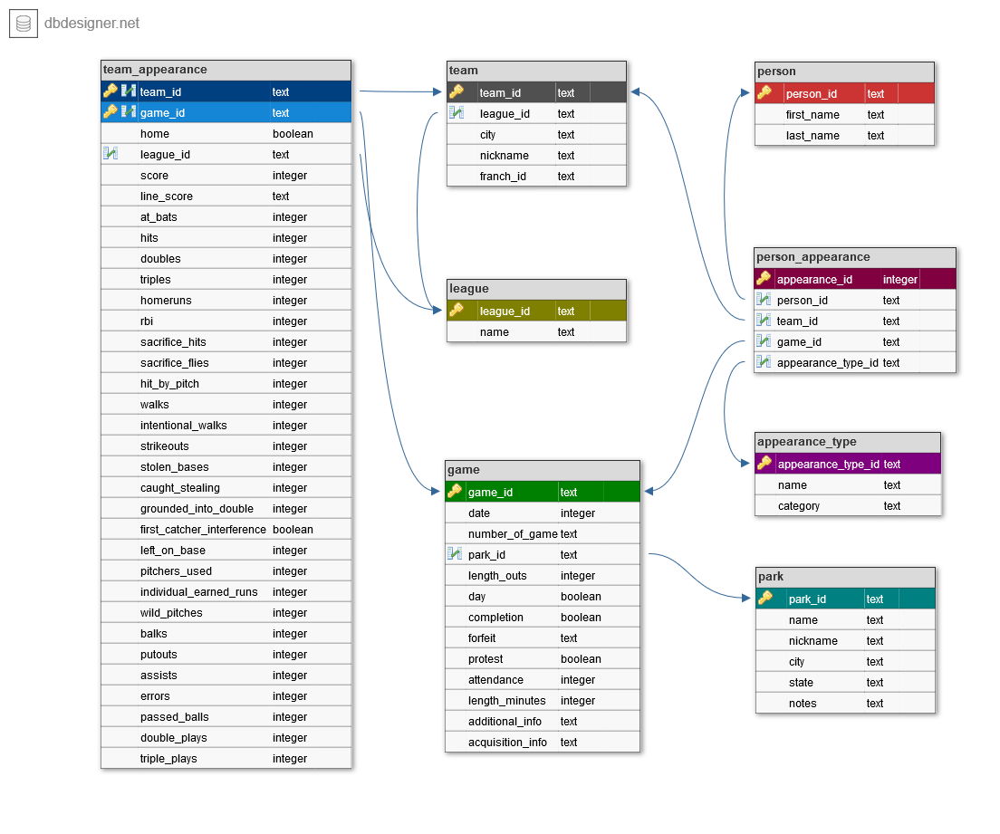

Designing and Creating a Database
================

The data in this project is from Major League Baseball games compiled by
[Retrosheet](https://www.retrosheet.org/). The main file we will work
from is `game_log.csv`, which has been compiled and pre-cleaned from 127
separate .csv files from Retrosheet. The goal of this project is to
convert and normalize this data into several separate tables in SQL and
create a database of game-level statistics.

Data provided by [Dataquest](https://www.dataquest.io): the main data
file `game_log.csv`, helper files `park_codes.csv`, `person_codes.csv`
and `team_codes.csv`. Description of the `game_log.csv` columns is in
`game_log_fields.txt` and there is an additional helper file
`appearance_type.csv`.

### Exploring the data

To read in and explore the
    data:

``` r
library(tidyverse)
```

    ## -- Attaching packages ---------------------------------------------------------------------------------------------------- tidyverse 1.2.1 --

    ## v ggplot2 3.2.1     v purrr   0.3.2
    ## v tibble  2.1.3     v dplyr   0.8.3
    ## v tidyr   1.0.0     v stringr 1.4.0
    ## v readr   1.3.1     v forcats 0.4.0

    ## -- Conflicts ------------------------------------------------------------------------------------------------------- tidyverse_conflicts() --
    ## x dplyr::filter() masks stats::filter()
    ## x dplyr::lag()    masks stats::lag()

``` r
game_log <- read_csv("game_log.csv")
```

    ## Parsed with column specification:
    ## cols(
    ##   .default = col_double(),
    ##   day_of_week = col_character(),
    ##   v_name = col_character(),
    ##   v_league = col_logical(),
    ##   h_name = col_character(),
    ##   h_league = col_logical(),
    ##   day_night = col_character(),
    ##   completion = col_logical(),
    ##   forefeit = col_character(),
    ##   protest = col_logical(),
    ##   park_id = col_character(),
    ##   v_line_score = col_character(),
    ##   h_line_score = col_character(),
    ##   v_first_catcher_interference = col_logical(),
    ##   h_first_catcher_interference = col_logical(),
    ##   hp_umpire_id = col_character(),
    ##   hp_umpire_name = col_character(),
    ##   `1b_umpire_id` = col_character(),
    ##   `1b_umpire_name` = col_character(),
    ##   `2b_umpire_id` = col_logical(),
    ##   `2b_umpire_name` = col_logical()
    ##   # ... with 60 more columns
    ## )

    ## See spec(...) for full column specifications.

    ## Warning: 964299 parsing failures.
    ##  row      col           expected actual           file
    ## 1087 v_league 1/0/T/F/TRUE/FALSE     NL 'game_log.csv'
    ## 1087 h_league 1/0/T/F/TRUE/FALSE     NL 'game_log.csv'
    ## 1088 v_league 1/0/T/F/TRUE/FALSE     NL 'game_log.csv'
    ## 1088 h_league 1/0/T/F/TRUE/FALSE     NL 'game_log.csv'
    ## 1089 v_league 1/0/T/F/TRUE/FALSE     NL 'game_log.csv'
    ## .... ........ .................. ...... ..............
    ## See problems(...) for more details.

``` r
park_codes <- read_csv("park_codes.csv") 
```

    ## Parsed with column specification:
    ## cols(
    ##   park_id = col_character(),
    ##   name = col_character(),
    ##   aka = col_character(),
    ##   city = col_character(),
    ##   state = col_character(),
    ##   start = col_character(),
    ##   end = col_character(),
    ##   league = col_character(),
    ##   notes = col_character()
    ## )

``` r
person_codes <- read_csv("person_codes.csv")
```

    ## Parsed with column specification:
    ## cols(
    ##   id = col_character(),
    ##   last = col_character(),
    ##   first = col_character(),
    ##   player_debut = col_character(),
    ##   mgr_debut = col_character(),
    ##   coach_debut = col_character(),
    ##   ump_debut = col_character()
    ## )

``` r
team_codes <- read_csv("team_codes.csv")
```

    ## Parsed with column specification:
    ## cols(
    ##   team_id = col_character(),
    ##   league = col_character(),
    ##   start = col_double(),
    ##   end = col_double(),
    ##   city = col_character(),
    ##   nickname = col_character(),
    ##   franch_id = col_character(),
    ##   seq = col_double()
    ## )

``` r
dim(game_log)
```

    ## [1] 171907    161

``` r
head(game_log)
```

    ## # A tibble: 6 x 161
    ##     date number_of_game day_of_week v_name v_league v_game_number h_name
    ##    <dbl>          <dbl> <chr>       <chr>  <lgl>            <dbl> <chr> 
    ## 1 1.87e7              0 Thu         CL1    NA                   1 FW1   
    ## 2 1.87e7              0 Fri         BS1    NA                   1 WS3   
    ## 3 1.87e7              0 Sat         CL1    NA                   2 RC1   
    ## 4 1.87e7              0 Mon         CL1    NA                   3 CH1   
    ## 5 1.87e7              0 Tue         BS1    NA                   2 TRO   
    ## 6 1.87e7              0 Thu         CH1    NA                   2 CL1   
    ## # ... with 154 more variables: h_league <lgl>, h_game_number <dbl>,
    ## #   v_score <dbl>, h_score <dbl>, length_outs <dbl>, day_night <chr>,
    ## #   completion <lgl>, forefeit <chr>, protest <lgl>, park_id <chr>,
    ## #   attendance <dbl>, length_minutes <dbl>, v_line_score <chr>,
    ## #   h_line_score <chr>, v_at_bats <dbl>, v_hits <dbl>, v_doubles <dbl>,
    ## #   v_triples <dbl>, v_homeruns <dbl>, v_rbi <dbl>,
    ## #   v_sacrifice_hits <dbl>, v_sacrifice_flies <dbl>, v_hit_by_pitch <dbl>,
    ## #   v_walks <dbl>, v_intentional_walks <dbl>, v_strikeouts <dbl>,
    ## #   v_stolen_bases <dbl>, v_caught_stealing <dbl>,
    ## #   v_grounded_into_double <dbl>, v_first_catcher_interference <lgl>,
    ## #   v_left_on_base <dbl>, v_pitchers_used <dbl>,
    ## #   v_individual_earned_runs <dbl>, v_team_earned_runs <dbl>,
    ## #   v_wild_pitches <dbl>, v_balks <dbl>, v_putouts <dbl>, v_assists <dbl>,
    ## #   v_errors <dbl>, v_passed_balls <dbl>, v_double_plays <dbl>,
    ## #   v_triple_plays <dbl>, h_at_bats <dbl>, h_hits <dbl>, h_doubles <dbl>,
    ## #   h_triples <dbl>, h_homeruns <dbl>, h_rbi <dbl>,
    ## #   h_sacrifice_hits <dbl>, h_sacrifice_flies <dbl>, h_hit_by_pitch <dbl>,
    ## #   h_walks <dbl>, h_intentional_walks <dbl>, h_strikeouts <dbl>,
    ## #   h_stolen_bases <dbl>, h_caught_stealing <dbl>,
    ## #   h_grounded_into_double <dbl>, h_first_catcher_interference <lgl>,
    ## #   h_left_on_base <dbl>, h_pitchers_used <dbl>,
    ## #   h_individual_earned_runs <dbl>, h_team_earned_runs <dbl>,
    ## #   h_wild_pitches <dbl>, h_balks <dbl>, h_putouts <dbl>, h_assists <dbl>,
    ## #   h_errors <dbl>, h_passed_balls <dbl>, h_double_plays <dbl>,
    ## #   h_triple_plays <dbl>, hp_umpire_id <chr>, hp_umpire_name <chr>,
    ## #   `1b_umpire_id` <chr>, `1b_umpire_name` <chr>, `2b_umpire_id` <lgl>,
    ## #   `2b_umpire_name` <lgl>, `3b_umpire_id` <lgl>, `3b_umpire_name` <lgl>,
    ## #   lf_umpire_id <lgl>, lf_umpire_name <lgl>, rf_umpire_id <lgl>,
    ## #   rf_umpire_name <lgl>, v_manager_id <chr>, v_manager_name <chr>,
    ## #   h_manager_id <chr>, h_manager_name <chr>, winning_pitcher_id <chr>,
    ## #   winning_pitcher_name <chr>, losing_pitcher_id <chr>,
    ## #   losing_pitcher_name <chr>, saving_pitcher_id <chr>,
    ## #   saving_pitcher_name <chr>, winning_rbi_batter_id <lgl>,
    ## #   winning_rbi_batter_id_name <lgl>, v_starting_pitcher_id <chr>,
    ## #   v_starting_pitcher_name <chr>, h_starting_pitcher_id <chr>,
    ## #   h_starting_pitcher_name <chr>, v_player_1_id <chr>,
    ## #   v_player_1_name <chr>, ...

``` r
dim(park_codes)
```

    ## [1] 252   9

``` r
head(park_codes)
```

    ## # A tibble: 6 x 9
    ##   park_id name      aka         city   state start end   league notes      
    ##   <chr>   <chr>     <chr>       <chr>  <chr> <chr> <chr> <chr>  <chr>      
    ## 1 ALB01   Riversid~ <NA>        Albany NY    09/1~ 05/3~ NL     TRN:9/11/8~
    ## 2 ALT01   Columbia~ <NA>        Altoo~ PA    04/3~ 05/3~ UA     <NA>       
    ## 3 ANA01   Angel St~ Edison Fie~ Anahe~ CA    04/1~ <NA>  AL     <NA>       
    ## 4 ARL01   Arlingto~ <NA>        Arlin~ TX    04/2~ 10/0~ AL     <NA>       
    ## 5 ARL02   Rangers ~ The Ballpa~ Arlin~ TX    04/1~ <NA>  AL     <NA>       
    ## 6 ATL01   Atlanta-~ <NA>        Atlan~ GA    04/1~ 09/2~ NL     <NA>

``` r
dim(person_codes)
```

    ## [1] 20494     7

``` r
head(person_codes)
```

    ## # A tibble: 6 x 7
    ##   id       last    first    player_debut mgr_debut coach_debut ump_debut
    ##   <chr>    <chr>   <chr>    <chr>        <chr>     <chr>       <chr>    
    ## 1 aardd001 Aardsma David    04/06/2004   <NA>      <NA>        <NA>     
    ## 2 aaroh101 Aaron   Hank     04/13/1954   <NA>      <NA>        <NA>     
    ## 3 aarot101 Aaron   Tommie   04/10/1962   <NA>      04/06/1979  <NA>     
    ## 4 aased001 Aase    Don      07/26/1977   <NA>      <NA>        <NA>     
    ## 5 abada001 Abad    Andy     09/10/2001   <NA>      <NA>        <NA>     
    ## 6 abadf001 Abad    Fernando 07/28/2010   <NA>      <NA>        <NA>

``` r
dim(team_codes)
```

    ## [1] 150   8

``` r
head(team_codes)
```

    ## # A tibble: 6 x 8
    ##   team_id league start   end city      nickname        franch_id   seq
    ##   <chr>   <chr>  <dbl> <dbl> <chr>     <chr>           <chr>     <dbl>
    ## 1 ALT     UA      1884  1884 Altoona   Mountain Cities ALT           1
    ## 2 ARI     NL      1998     0 Arizona   Diamondbacks    ARI           1
    ## 3 BFN     NL      1879  1885 Buffalo   Bisons          BFN           1
    ## 4 BFP     PL      1890  1890 Buffalo   Bisons          BFP           1
    ## 5 BL1     <NA>    1872  1874 Baltimore Canaries        BL1           1
    ## 6 BL2     AA      1882  1891 Baltimore Orioles         BL2           1

``` r
description <- readLines("game_log_fields.txt")
#View(description)
```

The main file `game_log.csv` has information about the games in 161
columns: date of the game, number of game (single or number of game in
double/triple header), day of the week, visiting/home team, league, game
number and score, length of game in outs, day/night indicator, info on
completion, forfeit and protest, park ID, attendance, time of game in
minutes, visiting and home line scores, visiting/home team offensive,
pitching and defensive statistics, umpire ID and name (home plate, 1B,
2B, 3B, LF, RF), visiting/home team manager, visiting/home winning
pitcher, losing pitcher, saving pitcher, game winning RBI batter and
starting pitcher, visiting/home starting players (offense and defense)
ID and name, additional and acquisition information.

Regarding the helper files:

  - `park_codes.csv` (9 columns) has information about the parks where
    the games were held: park ID (also present in the main file), park
    name and alias, city and state of the park, first and last date of
    games played at the park, league and notes.
  - `person_codes.csv` (7 columns) has information about the players:
    player ID (also present in the main file), first and last name, date
    of debut as player, manager, coach and/or umpire.
  - `team_codes.csv` (8 columns) has information about teams: team ID
    (also present in the main file), start and end year of the team,
    city of the team, team nickname, franch\_id and seq columns.

#### The intersection of data

The `park_id` in `park_codes.csv` intersects with `park_id` in the
`game_log.csv`.

The `id` in `person_codes.csv` intersects with umpire, manager, pitcher,
batter and player IDs in the `game_log.csv`.

The `team_id` in `team_codes.csv` intersects with `v_name` and `h_name`
in `game_log.csv`.

#### About baseball

Baseball is a game played between two teams (each has 9 players) that
take turns playing offense (batting and baserunning) and defense
(pitching and fielding). A pair of turns (one team at bat and one in the
field, by each team) is an inning. Game consists of 9 innings. When 3
outs are recorded, the teams switch roles for the next half-inning. The
goal of the game is to score more points (runs) than the other team. If
the score of the game is tied after nine innings, extra innings are
played to resolve the game. The referees are called umpires or umps.

#### Defensive positions

To explore defensive position numbers:

``` r
unique(game_log$v_player_1_def_pos)
```

    ##  [1]  2  6  3  9  5  1  8  7  4 NA 10

Baseball position numbers:

  - 1 – Pitcher
  - 2 – Catcher
  - 3 – First Baseman
  - 4 – Second Baseman
  - 5 – Third Baseman
  - 6 – Shortstop
  - 7 – Left Fielder
  - 8 – Center Fielder
  - 9 – Right Fielder

We also have the values 10 and NA.

#### Leagues

To explore the leagues, we first check the league columns in `game_log`:

``` r
unique(game_log$v_league)
```

    ## [1] NA

``` r
unique(game_log$h_league)
```

    ## [1] NA

If we check the league column in `team_codes`:

``` r
unique(team_codes$league)
```

    ## [1] "UA" "NL" "PL" NA   "AA" "AL" "FL"

These are the leagues in our data:

  - NL - National League (founded 1876)
  - AL - American League (founded 1901)
  - UA - Union Association (just season 1884)
  - PL - Players’ League (just season 1890)
  - AA - American Association (from 1882 to 1891)
  - FL - Federal League (from 1914 to 1915)

NL and AA are two leagues that make up Major League Baseball in the USA
and Canada.

### Importing data into SQLite

To create tables for each of our .csv files into a new SQL database:

``` r
library(RSQLite)
mlb <- dbConnect(SQLite(), "mlb.db")
```

``` r
dbWriteTable(conn = mlb, name = "game_log", value = game_log, row.names=FALSE, header = TRUE)
```

``` r
dbWriteTable(conn = mlb, name = "park_codes", value = park_codes, row.names=FALSE, header = TRUE)
```

``` r
dbWriteTable(conn = mlb, name = "person_codes", value = person_codes, row.names=FALSE, header = TRUE)
```

``` r
dbWriteTable(conn = mlb, name = "team_codes", value = team_codes, row.names=FALSE, header = TRUE)
```

### Unique ID for each game

We want to create a single column that can be used as a primary key to
uniquely identify each game.

Retrosheet has this [data
dictionary](https://www.retrosheet.org/eventfile.htm) for their event
files (which lists every event within each game), which includes the
following description:

*“id Each game begins with a twelve character ID record which identifies
the date, home team, and number of the game. For example, ATL198304080
should be read as follows. The first three characters identify the home
team (the Braves). The next four are the year (1983). The next two are
the month (April) using the standard numeric notation, 04, followed by
the day (08). The last digit indicates if this is a single game (0),
first game (1) or second game (2) if more than one game is played during
a day, usually a double header The id record starts the description of a
game thus ending the description of the preceding game in the file.”*

In the description, 3 columns are used to create a composite key. To do
this we can concatenate `home_team`, `date` and `number_of_game` columns
in a new column `game_id`.

``` r
query <- "ALTER TABLE game_log
ADD COLUMN game_id TEXT;"
dbExecute(mlb, query)
```

    ## [1] 0

``` r
query <- "UPDATE game_log
SET game_id = CAST(h_name AS TEXT) || CAST(CAST(date AS INTEGER) AS TEXT) || CAST(CAST(number_of_game AS INTEGER) AS TEXT);"
dbExecute(mlb, query)
```

    ## [1] 171907

``` r
query <- "SELECT game_id FROM game_log LIMIT 5"
result <- dbGetQuery(mlb, query)
result
```

    ##        game_id
    ## 1 FW1187105040
    ## 2 WS3187105050
    ## 3 RC1187105060
    ## 4 CH1187105080
    ## 5 TRO187105090

### Normalization

We normalize a database to reduce redundancy and improve data integrity.
We can work on:

1.  column repetition
    
    In the `game_log` table we can find columns for every player
    position. We could stack these columns on top of each other and add
    another column to define the player position.

2.  non-primary key columns should be attributes of the primary key
    
    Any columns that are not an attribute to the primary key are better
    placed in their own tables. For example, the primary key of  
    `game_log` table is `game_id`. Players’ names are not attributes of
    a game, but of the player ID. Since we already have a table
    `person_codes` with player IDs and names, we can remove the players’
    names from `game_log`.

3.  repetition of data across tables
    
    Additionally, we want to eliminate any redundant data available
    elsewhere. For example, the `park_codes` table’s `start` and `end`
    column store the information about the first and last games played
    at the park. This information is already in `game_log` table for
    each game, so we can remove these columns.

This is the plan for our schema:



### Creating tables without foreign key relations

To create the `person` table according to schema diagram:

``` r
query <- "CREATE TABLE person (
    person_id TEXT PRIMARY KEY,
    first_name TEXT,
    last_name TEXT
);
"
dbExecute(mlb, query)
```

    ## [1] 0

``` r
query <- "INSERT INTO person
SELECT id, first, last FROM person_codes;"
dbExecute(mlb, query)
```

    ## [1] 20494

``` r
query <- "SELECT * FROM person LIMIT 5"
result <- dbGetQuery(mlb, query)
result
```

    ##   person_id first_name last_name
    ## 1  aardd001      David   Aardsma
    ## 2  aaroh101       Hank     Aaron
    ## 3  aarot101     Tommie     Aaron
    ## 4  aased001        Don      Aase
    ## 5  abada001       Andy      Abad

To create the `park` table according to schema diagram:

``` r
query <- "CREATE TABLE park (
    park_id TEXT,
    name TEXT,
    nickname TEXT,
    city TEXT,
    state TEXT,
    notes TEXT
);"
dbExecute(mlb, query)
```

    ## [1] 0

``` r
query <- "INSERT INTO park
SELECT park_id, name, aka, city, state, notes FROM park_codes;"
dbExecute(mlb, query)
```

    ## [1] 252

``` r
query <- "SELECT * FROM park LIMIT 5"
result <- dbGetQuery(mlb, query)
result
```

    ##   park_id                          name
    ## 1   ALB01                Riverside Park
    ## 2   ALT01                 Columbia Park
    ## 3   ANA01      Angel Stadium of Anaheim
    ## 4   ARL01             Arlington Stadium
    ## 5   ARL02 Rangers Ballpark in Arlington
    ##                                   nickname      city state
    ## 1                                     <NA>    Albany    NY
    ## 2                                     <NA>   Altoona    PA
    ## 3            Edison Field; Anaheim Stadium   Anaheim    CA
    ## 4                                     <NA> Arlington    TX
    ## 5 The Ballpark in Arlington; Ameriquest Fl Arlington    TX
    ##                                            notes
    ## 1 TRN:9/11/80;6/15&9/10/1881;5/16-5/18&5/30/1882
    ## 2                                           <NA>
    ## 3                                           <NA>
    ## 4                                           <NA>
    ## 5                                           <NA>

To create the `league` table according to schema diagram:

``` r
query <- "CREATE TABLE league (
    league_id TEXT PRIMARY KEY,
    name TEXT
);"
dbExecute(mlb, query)
```

    ## [1] 0

``` r
query <- "INSERT INTO league
VALUES 
   ('NL', 'National League'),
   ('AL', 'American League'),
   ('UA', 'Union Association'),
   ('PL', 'Players League'),
   ('AA', 'American Association'),
   ('FL', 'Federal League')
;"
dbExecute(mlb, query)
```

    ## [1] 6

``` r
query <- "SELECT * FROM league"
result <- dbGetQuery(mlb, query)
result
```

    ##   league_id                 name
    ## 1        NL      National League
    ## 2        AL      American League
    ## 3        UA    Union Association
    ## 4        PL       Players League
    ## 5        AA American Association
    ## 6        FL       Federal League

To create the `appearance_type` table according to schema diagram using
the provided `appearance_type.csv`:

``` r
appearance_type_csv <- read_csv("appearance_type.csv")
```

    ## Parsed with column specification:
    ## cols(
    ##   appearance_type_id = col_character(),
    ##   name = col_character(),
    ##   category = col_character()
    ## )

``` r
head(appearance_type_csv)
```

    ## # A tibble: 6 x 3
    ##   appearance_type_id name     category
    ##   <chr>              <chr>    <chr>   
    ## 1 O1                 Batter 1 offense 
    ## 2 O2                 Batter 2 offense 
    ## 3 O3                 Batter 3 offense 
    ## 4 O4                 Batter 4 offense 
    ## 5 O5                 Batter 5 offense 
    ## 6 O6                 Batter 6 offense

``` r
dbWriteTable(conn = mlb, name = "appearance_type_csv", value = appearance_type_csv, row.names=FALSE, header = TRUE)
```

``` r
query <- "SELECT * FROM appearance_type_csv"
result <- dbGetQuery(mlb, query)
result
```

    ##    appearance_type_id               name category
    ## 1                  O1           Batter 1  offense
    ## 2                  O2           Batter 2  offense
    ## 3                  O3           Batter 3  offense
    ## 4                  O4           Batter 4  offense
    ## 5                  O5           Batter 5  offense
    ## 6                  O6           Batter 6  offense
    ## 7                  O7           Batter 7  offense
    ## 8                  O8           Batter 8  offense
    ## 9                  O9           Batter 9  offense
    ## 10                 D1            Pitcher  defense
    ## 11                 D2            Catcher  defense
    ## 12                 D3           1st Base  defense
    ## 13                 D4           2nd Base  defense
    ## 14                 D5           3rd Base  defense
    ## 15                 D6          Shortstop  defense
    ## 16                 D7         Left Field  defense
    ## 17                 D8       Center Field  defense
    ## 18                 D9        Right Field  defense
    ## 19                D10   Unknown Position  defense
    ## 20                UHP         Home Plate   umpire
    ## 21                U1B         First Base   umpire
    ## 22                U2B        Second Base   umpire
    ## 23                U3B         Third Base   umpire
    ## 24                ULF         Left Field   umpire
    ## 25                URF        Right Field   umpire
    ## 26                 MM            Manager  manager
    ## 27                AWP    Winning Pitcher    award
    ## 28                ALP     Losing Pitcher    award
    ## 29                ASP     Saving Pitcher    award
    ## 30                AWB Winning RBI Batter    award
    ## 31                PSP   Starting Pitcher  pitcher

``` r
query <- "CREATE TABLE appearance_type (
    appearance_type_id TEXT PRIMARY KEY,
    name TEXT,
    category TEXT
);"
dbExecute(mlb, query)
```

    ## [1] 0

``` r
query <- "INSERT INTO appearance_type
SELECT appearance_type_id, name, category FROM appearance_type_csv;"
dbExecute(mlb, query)
```

    ## [1] 31

``` r
query <- "SELECT * FROM appearance_type LIMIT 5"
result <- dbGetQuery(mlb, query)
result
```

    ##   appearance_type_id     name category
    ## 1                 O1 Batter 1  offense
    ## 2                 O2 Batter 2  offense
    ## 3                 O3 Batter 3  offense
    ## 4                 O4 Batter 4  offense
    ## 5                 O5 Batter 5  offense

### Creating tables with one foreign key

To create the `team` table according to schema diagram:

``` r
query <- "CREATE TABLE team (
    team_id TEXT,
    league_id TEXT,
    city TEXT,
    nickname TEXT,
    franch_id TEXT,
FOREIGN KEY (league_id) REFERENCES league(league_id)
);"
dbExecute(mlb, query)
```

    ## [1] 0

``` r
query <- "INSERT INTO team
SELECT team_id, league, city, nickname, franch_id FROM team_codes;"
dbExecute(mlb, query)
```

    ## [1] 150

``` r
query <- "SELECT * FROM team LIMIT 5"
result <- dbGetQuery(mlb, query)
result
```

    ##   team_id league_id      city        nickname franch_id
    ## 1     ALT        UA   Altoona Mountain Cities       ALT
    ## 2     ARI        NL   Arizona    Diamondbacks       ARI
    ## 3     BFN        NL   Buffalo          Bisons       BFN
    ## 4     BFP        PL   Buffalo          Bisons       BFP
    ## 5     BL1      <NA> Baltimore        Canaries       BL1

To create the `game` table according to schema diagram:

``` r
query <- "CREATE TABLE game (
    game_id TEXT,
    date INTEGER,
    number_of_game TEXT,
    park_id TEXT,
    length_outs INTEGER,
    day NUMERIC,
    completion NUMERIC,
    forfeit TEXT,
    protest NUMERIC,
    attendance INTEGER,
    length_minutes INTEGER,
    additional_info TEXT,
    acquisition_info TEXT,
FOREIGN KEY (park_id) REFERENCES park(park_id)
);"
dbExecute(mlb, query)
```

    ## [1] 0

``` r
query <- "INSERT INTO game
SELECT game_id, date, CAST(number_of_game AS INTEGER), park_id, length_outs, CAST(day_night AS NUMERIC), CAST(completion AS NUMERIC), forefeit, CAST(protest AS NUMERIC), attendance, length_minutes, additional_info, acquisition_info FROM game_log;"
dbExecute(mlb, query)
```

    ## [1] 171907

``` r
query <- "SELECT * FROM game LIMIT 5"
result <- dbGetQuery(mlb, query)
result
```

    ##        game_id     date number_of_game park_id length_outs day completion
    ## 1 FW1187105040 18710504              0   FOR01          54   0         NA
    ## 2 WS3187105050 18710505              0   WAS01          54   0         NA
    ## 3 RC1187105060 18710506              0   RCK01          54   0         NA
    ## 4 CH1187105080 18710508              0   CHI01          54   0         NA
    ## 5 TRO187105090 18710509              0   TRO01          54   0         NA
    ##   forfeit protest attendance length_minutes additional_info
    ## 1    <NA>      NA        200            120            <NA>
    ## 2    <NA>      NA       5000            145            HTBF
    ## 3    <NA>      NA       1000            140            <NA>
    ## 4    <NA>      NA       5000            150            <NA>
    ## 5    <NA>      NA       3250            145            HTBF
    ##   acquisition_info
    ## 1                Y
    ## 2                Y
    ## 3                Y
    ## 4                Y
    ## 5                Y

### Creating tables with more than one key

To create the `team_appearance` table (with a compound primary key and 3
foreign keys):

``` r
query <- "CREATE TABLE team_appearance (
    team_id TEXT,
    game_id TEXT,
    home NUMERIC,
    league_id TEXT,
    score INTEGER,
    line_score TEXT,
    at_bats INTEGER,
    hits INTEGER,
    doubles INTEGER,
    triples INTEGER,
    homeruns INTEGER,
    rbi INTEGER,
    sacrifice_hits INTEGER,
    sacrifice_flies INTEGER,
    hit_by_pitch INTEGER,
    walks INTEGER,
    intentional_walks INTEGER,
    strikeouts INTEGER,
    stolen_bases INTEGER,
    caught_stealing INTEGER,
    grounded_into_double INTEGER,
    first_catcher_interference NUMERIC,
    left_on_base INTEGER,
    pitchers_used INTEGER,
    individual_earned_runs INTEGER,
    wild_pitches INTEGER,
    balks INTEGER,
    putouts INTEGER,
    assists INTEGER,
    errors INTEGER,
    passed_balls INTEGER,
    double_plays INTEGER,
    triple_plays INTEGER,
PRIMARY KEY (team_id, game_id),
FOREIGN KEY (team_id) REFERENCES team(team_id),
FOREIGN KEY (game_id) REFERENCES game(game_id),
FOREIGN KEY (league_id) REFERENCES league(league_id)
);"
dbExecute(mlb, query)
```

    ## [1] 0

``` r
glimpse(game_log)
```

    ## Observations: 171,907
    ## Variables: 161
    ## $ date                         <dbl> 18710504, 18710505, 18710506, 187...
    ## $ number_of_game               <dbl> 0, 0, 0, 0, 0, 0, 0, 0, 0, 0, 0, ...
    ## $ day_of_week                  <chr> "Thu", "Fri", "Sat", "Mon", "Tue"...
    ## $ v_name                       <chr> "CL1", "BS1", "CL1", "CL1", "BS1"...
    ## $ v_league                     <lgl> NA, NA, NA, NA, NA, NA, NA, NA, N...
    ## $ v_game_number                <dbl> 1, 1, 2, 3, 2, 2, 2, 3, 3, 2, 4, ...
    ## $ h_name                       <chr> "FW1", "WS3", "RC1", "CH1", "TRO"...
    ## $ h_league                     <lgl> NA, NA, NA, NA, NA, NA, NA, NA, N...
    ## $ h_game_number                <dbl> 1, 1, 1, 1, 1, 4, 5, 2, 3, 3, 4, ...
    ## $ v_score                      <dbl> 0, 20, 12, 12, 9, 18, 12, 14, 6, ...
    ## $ h_score                      <dbl> 2, 18, 4, 14, 5, 10, 8, 5, 12, 14...
    ## $ length_outs                  <dbl> 54, 54, 54, 54, 54, 48, 54, 54, 5...
    ## $ day_night                    <chr> "D", "D", "D", "D", "D", "D", "D"...
    ## $ completion                   <lgl> NA, NA, NA, NA, NA, NA, NA, NA, N...
    ## $ forefeit                     <chr> NA, NA, NA, NA, NA, "V", NA, NA, ...
    ## $ protest                      <lgl> NA, NA, NA, NA, NA, NA, NA, NA, N...
    ## $ park_id                      <chr> "FOR01", "WAS01", "RCK01", "CHI01...
    ## $ attendance                   <dbl> 200, 5000, 1000, 5000, 3250, 2500...
    ## $ length_minutes               <dbl> 120, 145, 140, 150, 145, 120, 150...
    ## $ v_line_score                 <chr> "000000000", "107000435", "610020...
    ## $ h_line_score                 <chr> "010010000", "640113030", "010020...
    ## $ v_at_bats                    <dbl> 30, 41, 49, 46, 46, 41, 42, 45, 4...
    ## $ v_hits                       <dbl> 4, 13, 11, 15, 17, 15, 9, 17, 8, ...
    ## $ v_doubles                    <dbl> 1, 1, 1, 2, 4, 1, 2, 5, 0, 3, 2, ...
    ## $ v_triples                    <dbl> 0, 2, 1, 1, 1, 3, 0, 2, 0, 1, 0, ...
    ## $ v_homeruns                   <dbl> 0, 0, 0, 2, 0, 3, 0, 0, 0, 0, 0, ...
    ## $ v_rbi                        <dbl> 0, 13, 8, 10, 6, 10, 5, 10, 2, 26...
    ## $ v_sacrifice_hits             <dbl> 0, 0, 0, 0, 0, 0, 0, 0, 0, 0, 0, ...
    ## $ v_sacrifice_flies            <dbl> 0, 0, 0, 0, 0, 0, 0, 0, 0, 0, 0, ...
    ## $ v_hit_by_pitch               <dbl> 0, 0, 0, 0, 0, 0, 0, 0, 0, 0, 0, ...
    ## $ v_walks                      <dbl> 1, 18, 0, 0, 2, 8, 1, 1, 1, 2, 1,...
    ## $ v_intentional_walks          <dbl> NA, NA, NA, NA, NA, NA, NA, NA, N...
    ## $ v_strikeouts                 <dbl> 6, 5, 1, 1, 0, 1, 1, 1, 1, 0, 0, ...
    ## $ v_stolen_bases               <dbl> 1, 3, 0, 0, 1, 0, 1, 2, 1, 3, 0, ...
    ## $ v_caught_stealing            <dbl> NA, NA, NA, NA, NA, NA, NA, NA, N...
    ## $ v_grounded_into_double       <dbl> -1, -1, -1, -1, -1, -1, -1, -1, -...
    ## $ v_first_catcher_interference <lgl> NA, NA, NA, NA, NA, NA, NA, NA, N...
    ## $ v_left_on_base               <dbl> 4, 12, 10, 7, 12, 7, 4, 5, 10, 10...
    ## $ v_pitchers_used              <dbl> 1, 1, 1, 1, 1, 1, 1, 1, 1, 1, 1, ...
    ## $ v_individual_earned_runs     <dbl> 1, 6, 0, 6, 2, 4, 2, 2, 4, 4, 2, ...
    ## $ v_team_earned_runs           <dbl> 1, 6, 0, 6, 2, 4, 2, 2, 4, 4, 2, ...
    ## $ v_wild_pitches               <dbl> 0, 1, 2, 0, 0, 0, 0, 0, 0, 0, 0, ...
    ## $ v_balks                      <dbl> 0, 0, 0, 0, 0, 0, 0, 0, 0, 0, 0, ...
    ## $ v_putouts                    <dbl> 27, 27, 27, 27, 27, 24, 27, 27, 2...
    ## $ v_assists                    <dbl> 9, 13, 12, 15, 12, 11, 9, 8, 13, ...
    ## $ v_errors                     <dbl> 0, 10, 8, 11, 5, 4, 6, 4, 5, 8, 1...
    ## $ v_passed_balls               <dbl> 3, 1, 5, 6, 0, 3, 3, 2, 6, 3, 6, ...
    ## $ v_double_plays               <dbl> 0, 2, 0, 0, 1, 0, 1, 0, 0, 3, 1, ...
    ## $ v_triple_plays               <dbl> 0, 0, 0, 0, 0, 0, 0, 0, 0, 0, 0, ...
    ## $ h_at_bats                    <dbl> 31, 49, 36, 43, 36, 39, 39, 33, 4...
    ## $ h_hits                       <dbl> 4, 14, 7, 11, 9, 13, 11, 5, 20, 1...
    ## $ h_doubles                    <dbl> 1, 2, 2, 2, 0, 1, 1, 1, 5, 3, 4, ...
    ## $ h_triples                    <dbl> 0, 0, 1, 0, 0, 2, 1, 2, 0, 0, 0, ...
    ## $ h_homeruns                   <dbl> 0, 0, 0, 0, 0, 1, 0, 0, 0, 0, 0, ...
    ## $ h_rbi                        <dbl> 2, 11, 2, 8, 2, 7, 5, 3, 9, 9, 9,...
    ## $ h_sacrifice_hits             <dbl> 0, 0, 0, 0, 0, 0, 0, 0, 0, 0, 0, ...
    ## $ h_sacrifice_flies            <dbl> 0, 0, 0, 0, 0, 0, 0, 0, 0, 0, 0, ...
    ## $ h_hit_by_pitch               <dbl> 0, 0, 0, 0, 0, 0, 0, 0, 0, 0, 0, ...
    ## $ h_walks                      <dbl> 1, 10, 0, 4, 3, 0, 0, 3, 0, 4, 1,...
    ## $ h_intentional_walks          <dbl> NA, NA, NA, NA, NA, NA, NA, NA, N...
    ## $ h_strikeouts                 <dbl> 0, 2, 3, 2, 0, 0, 1, 1, 1, 1, 0, ...
    ## $ h_stolen_bases               <dbl> 0, 1, 5, 1, 2, 0, 0, 0, 1, 3, 3, ...
    ## $ h_caught_stealing            <dbl> NA, NA, NA, NA, NA, NA, NA, NA, N...
    ## $ h_grounded_into_double       <dbl> -1, -1, -1, -1, -1, -1, -1, -1, -...
    ## $ h_first_catcher_interference <lgl> NA, NA, NA, NA, NA, NA, NA, NA, N...
    ## $ h_left_on_base               <dbl> 3, 14, 5, 6, 7, 5, 4, 4, 10, 6, 7...
    ## $ h_pitchers_used              <dbl> 1, 1, 1, 1, 1, 2, 1, 1, 1, 1, 1, ...
    ## $ h_individual_earned_runs     <dbl> 0, 7, 3, 4, 3, 10, 3, 6, 1, 10, 2...
    ## $ h_team_earned_runs           <dbl> 0, 7, 3, 4, 3, 10, 3, 6, 1, 10, 2...
    ## $ h_wild_pitches               <dbl> 0, 0, 1, 0, 1, 2, 3, 0, 0, 0, 1, ...
    ## $ h_balks                      <dbl> 0, 0, 0, 0, 0, 0, 0, 0, 0, 0, 0, ...
    ## $ h_putouts                    <dbl> 27, 27, 27, 27, 27, 24, 27, 27, 2...
    ## $ h_assists                    <dbl> 3, 20, 12, 14, 11, 7, 6, 8, 6, 17...
    ## $ h_errors                     <dbl> 3, 10, 13, 7, 7, 5, 8, 7, 9, 15, ...
    ## $ h_passed_balls               <dbl> 1, 2, 3, 2, 3, 2, 1, 3, 2, 2, 2, ...
    ## $ h_double_plays               <dbl> 1, 3, 0, 0, 0, 0, 0, 0, 0, 1, 2, ...
    ## $ h_triple_plays               <dbl> 0, 0, 0, 0, 0, 0, 0, 0, 0, 0, 0, ...
    ## $ hp_umpire_id                 <chr> "boakj901", "dobsh901", "mawnj901...
    ## $ hp_umpire_name               <chr> "John Boake", "Henry Dobson", "J....
    ## $ `1b_umpire_id`               <chr> NA, NA, NA, NA, NA, NA, NA, NA, N...
    ## $ `1b_umpire_name`             <chr> NA, NA, NA, NA, NA, NA, NA, NA, N...
    ## $ `2b_umpire_id`               <lgl> NA, NA, NA, NA, NA, NA, NA, NA, N...
    ## $ `2b_umpire_name`             <lgl> NA, NA, NA, NA, NA, NA, NA, NA, N...
    ## $ `3b_umpire_id`               <lgl> NA, NA, NA, NA, NA, NA, NA, NA, N...
    ## $ `3b_umpire_name`             <lgl> NA, NA, NA, NA, NA, NA, NA, NA, N...
    ## $ lf_umpire_id                 <lgl> NA, NA, NA, NA, NA, NA, NA, NA, N...
    ## $ lf_umpire_name               <lgl> NA, NA, NA, NA, NA, NA, NA, NA, N...
    ## $ rf_umpire_id                 <lgl> NA, NA, NA, NA, NA, NA, NA, NA, N...
    ## $ rf_umpire_name               <lgl> NA, NA, NA, NA, NA, NA, NA, NA, N...
    ## $ v_manager_id                 <chr> "paboc101", "wrigh101", "paboc101...
    ## $ v_manager_name               <chr> "Charlie Pabor", "Harry Wright", ...
    ## $ h_manager_id                 <chr> "lennb101", "younn801", "hasts101...
    ## $ h_manager_name               <chr> "Bill Lennon", "Nick Young", "Sco...
    ## $ winning_pitcher_id           <chr> "mathb101", "spala101", "prata101...
    ## $ winning_pitcher_name         <chr> "Bobby Mathews", "Al Spalding", "...
    ## $ losing_pitcher_id            <chr> "prata101", "braia102", "fishc102...
    ## $ losing_pitcher_name          <chr> "Al Pratt", "Asa Brainard", "Cher...
    ## $ saving_pitcher_id            <chr> NA, NA, NA, NA, NA, NA, NA, NA, N...
    ## $ saving_pitcher_name          <chr> NA, NA, NA, NA, NA, NA, NA, NA, N...
    ## $ winning_rbi_batter_id        <lgl> NA, NA, NA, NA, NA, NA, NA, NA, N...
    ## $ winning_rbi_batter_id_name   <lgl> NA, NA, NA, NA, NA, NA, NA, NA, N...
    ## $ v_starting_pitcher_id        <chr> "prata101", "spala101", "prata101...
    ## $ v_starting_pitcher_name      <chr> "Al Pratt", "Al Spalding", "Al Pr...
    ## $ h_starting_pitcher_id        <chr> "mathb101", "braia102", "fishc102...
    ## $ h_starting_pitcher_name      <chr> "Bobby Mathews", "Asa Brainard", ...
    ## $ v_player_1_id                <chr> "whitd102", "wrigg101", "whitd102...
    ## $ v_player_1_name              <chr> "Deacon White", "George Wright", ...
    ## $ v_player_1_def_pos           <dbl> 2, 6, 2, 2, 6, 3, 2, 3, 2, 9, 2, ...
    ## $ v_player_2_id                <chr> "kimbg101", "barnr102", "kimbg101...
    ## $ v_player_2_name              <chr> "Gene Kimball", "Ross Barnes", "G...
    ## $ v_player_2_def_pos           <dbl> 4, 4, 4, 4, 4, 7, 6, 8, 6, 2, 6, ...
    ## $ v_player_3_id                <chr> "paboc101", "birdd102", "paboc101...
    ## $ v_player_3_name              <chr> "Charlie Pabor", "Dave Birdsall",...
    ## $ v_player_3_def_pos           <dbl> 7, 9, 7, 7, 9, 2, 3, 2, 3, 8, 3, ...
    ## $ v_player_4_id                <chr> "allia101", "mcvec101", "allia101...
    ## $ v_player_4_name              <chr> "Art Allison", "Cal McVey", "Art ...
    ## $ v_player_4_def_pos           <dbl> 8, 2, 8, 8, 2, 4, 9, 4, 9, 1, 9, ...
    ## $ v_player_5_id                <chr> "white104", "wrigh101", "white104...
    ## $ v_player_5_name              <chr> "Elmer White", "Harry Wright", "E...
    ## $ v_player_5_def_pos           <dbl> 9, 8, 9, 9, 8, 8, 5, 9, 5, 7, 5, ...
    ## $ v_player_6_id                <chr> "prata101", "goulc101", "prata101...
    ## $ v_player_6_name              <chr> "Al Pratt", "Charlie Gould", "Al ...
    ## $ v_player_6_def_pos           <dbl> 1, 3, 1, 1, 3, 9, 7, 7, 7, 4, 7, ...
    ## $ v_player_7_id                <chr> "sutte101", "schah101", "sutte101...
    ## $ v_player_7_name              <chr> "Ezra Sutton", "Harry Schafer", "...
    ## $ v_player_7_def_pos           <dbl> 5, 5, 5, 5, 5, 6, 1, 6, 1, 5, 1, ...
    ## $ v_player_8_id                <chr> "carlj102", "conef101", "carlj102...
    ## $ v_player_8_name              <chr> "Jim Carleton", "Fred Cone", "Jim...
    ## $ v_player_8_def_pos           <dbl> 3, 7, 3, 3, 7, 5, 8, 5, 8, 3, 8, ...
    ## $ v_player_9_id                <chr> "bassj101", "spala101", "bassj101...
    ## $ v_player_9_name              <chr> "John Bass", "Al Spalding", "John...
    ## $ v_player_9_def_pos           <dbl> 6, 1, 6, 6, 1, 1, 4, 1, 4, 6, 4, ...
    ## $ h_player_1_id                <chr> "selmf101", "watef102", "mackd101...
    ## $ h_player_1_name              <chr> "Frank Sellman", "Fred Waterman",...
    ## $ h_player_1_def_pos           <dbl> 5, 5, 3, 3, 9, 2, 2, 5, 5, 4, 3, ...
    ## $ h_player_2_id                <chr> "mathb101", "forcd101", "addyb101...
    ## $ h_player_2_name              <chr> "Bobby Mathews", "Davy Force", "B...
    ## $ h_player_2_def_pos           <dbl> 1, 6, 4, 8, 2, 4, 8, 1, 1, 9, 8, ...
    ## $ h_player_3_id                <chr> "foraj101", "mille105", "fishc102...
    ## $ h_player_3_name              <chr> "Jim Foran", "Everett Mills", "Ch...
    ## $ h_player_3_def_pos           <dbl> 3, 3, 1, 2, 8, 7, 7, 3, 3, 2, 2, ...
    ## $ h_player_4_id                <chr> "goldw101", "allid101", "hasts101...
    ## $ h_player_4_name              <chr> "Wally Goldsmith", "Doug Allison"...
    ## $ h_player_4_def_pos           <dbl> 6, 2, 8, 4, 1, 8, 3, 6, 6, 6, 4, ...
    ## $ h_player_5_id                <chr> "lennb101", "hallg101", "ham-r101...
    ## $ h_player_5_name              <chr> "Bill Lennon", "George Hall", "Ra...
    ## $ h_player_5_def_pos           <dbl> 2, 7, 5, 9, 7, 9, 4, 2, 2, 3, 9, ...
    ## $ h_player_6_id                <chr> "caret101", "leona101", "ansoc101...
    ## $ h_player_6_name              <chr> "Tom Carey", "Andy Leonard", "Cap...
    ## $ h_player_6_def_pos           <dbl> 4, 4, 2, 7, 4, 1, 1, 4, 4, 5, 7, ...
    ## $ h_player_7_id                <chr> "mince101", "braia102", "sagep101...
    ## $ h_player_7_name              <chr> "Ed Mincher", "Asa Brainard", "Po...
    ## $ h_player_7_def_pos           <dbl> 7, 1, 6, 6, 5, 5, 5, 7, 7, 7, 6, ...
    ## $ h_player_8_id                <chr> "mcdej101", "burrh101", "birdg101...
    ## $ h_player_8_name              <chr> "James McDermott", "Henry Burroug...
    ## $ h_player_8_def_pos           <dbl> 8, 9, 7, 5, 3, 3, 9, 8, 9, 1, 5, ...
    ## $ h_player_9_id                <chr> "kellb105", "berth101", "stirg101...
    ## $ h_player_9_name              <chr> "Bill Kelly", "Henry Berthrong", ...
    ## $ h_player_9_def_pos           <dbl> 9, 8, 9, 1, 6, 6, 6, 9, 8, 8, 1, ...
    ## $ additional_info              <chr> NA, "HTBF", NA, NA, "HTBF", NA, N...
    ## $ acquisition_info             <chr> "Y", "Y", "Y", "Y", "Y", "Y", "Y"...

``` r
query <- "INSERT INTO team_appearance
   SELECT
      h_name,
      game_id,
      1 AS home,
      h_league,
      h_score,
      h_line_score,
      h_at_bats,
      h_hits,
        h_doubles,
        h_triples,
        h_homeruns,
        h_rbi,
        h_sacrifice_hits,
        h_sacrifice_flies,
        h_hit_by_pitch,
        h_walks,
        h_intentional_walks,
        h_strikeouts,
        h_stolen_bases,
        h_caught_stealing,
        h_grounded_into_double,
        h_first_catcher_interference,
        h_left_on_base,
        h_pitchers_used,
        h_individual_earned_runs,
        h_wild_pitches,
        h_balks,
        h_putouts,
        h_assists,
        h_errors,
        h_passed_balls,
        h_double_plays,
        h_triple_plays
    FROM game_log
    
UNION

  SELECT
      v_name,
      game_id,
      0 AS home,
      v_league,
      v_score,
      v_line_score,
      v_at_bats,
      v_hits,
        v_doubles,
        v_triples,
        v_homeruns,
        v_rbi,
        v_sacrifice_hits,
        v_sacrifice_flies,
        v_hit_by_pitch,
        v_walks,
        v_intentional_walks,
        v_strikeouts,
        v_stolen_bases,
        v_caught_stealing,
        v_grounded_into_double,
        v_first_catcher_interference,
        v_left_on_base,
        v_pitchers_used,
        v_individual_earned_runs,
        v_wild_pitches,
        v_balks,
        v_putouts,
        v_assists,
        v_errors,
        v_passed_balls,
        v_double_plays,
        v_triple_plays
     FROM game_log;
"
dbExecute(mlb, query)
```

    ## [1] 343814

``` r
query <- "SELECT * FROM team_appearance LIMIT 5"
result <- dbGetQuery(mlb, query)
result
```

    ##   team_id      game_id home league_id score line_score at_bats hits
    ## 1     ALT ALT188404300    1      <NA>     2       <NA>      NA   NA
    ## 2     ALT ALT188405020    1      <NA>     3       <NA>      NA   NA
    ## 3     ALT ALT188405030    1      <NA>     5       <NA>      NA   NA
    ## 4     ALT ALT188405050    1      <NA>     2       <NA>      NA   NA
    ## 5     ALT ALT188405100    1      <NA>     9       <NA>      NA   NA
    ##   doubles triples homeruns rbi sacrifice_hits sacrifice_flies hit_by_pitch
    ## 1      NA      NA       NA  NA             NA              NA           NA
    ## 2      NA      NA       NA  NA             NA              NA           NA
    ## 3      NA      NA       NA  NA             NA              NA           NA
    ## 4      NA      NA       NA  NA             NA              NA           NA
    ## 5      NA      NA       NA  NA             NA              NA           NA
    ##   walks intentional_walks strikeouts stolen_bases caught_stealing
    ## 1    NA                NA         NA           NA              NA
    ## 2    NA                NA         NA           NA              NA
    ## 3    NA                NA         NA           NA              NA
    ## 4    NA                NA         NA           NA              NA
    ## 5    NA                NA         NA           NA              NA
    ##   grounded_into_double first_catcher_interference left_on_base
    ## 1                   NA                         NA           NA
    ## 2                   NA                         NA           NA
    ## 3                   NA                         NA           NA
    ## 4                   NA                         NA           NA
    ## 5                   NA                         NA           NA
    ##   pitchers_used individual_earned_runs wild_pitches balks putouts assists
    ## 1            NA                     NA           NA    NA      NA      NA
    ## 2            NA                     NA           NA    NA      NA      NA
    ## 3            NA                     NA           NA    NA      NA      NA
    ## 4            NA                     NA           NA    NA      NA      NA
    ## 5            NA                     NA           NA    NA      NA      NA
    ##   errors passed_balls double_plays triple_plays
    ## 1     NA           NA           NA           NA
    ## 2     NA           NA           NA           NA
    ## 3     NA           NA           NA           NA
    ## 4     NA           NA           NA           NA
    ## 5     NA           NA           NA           NA

To create the `person_appearance` table (with 4 foreign keys):

``` r
query <- "CREATE TABLE person_appearance (
    appearance_id INTEGER PRIMARY KEY,
    person_id TEXT,
    team_id TEXT,
    game_id TEXT,
    appearance_type_id TEXT,
FOREIGN KEY (person_id) REFERENCES person(person_id),
FOREIGN KEY (team_id) REFERENCES team(team_id),
FOREIGN KEY (game_id) REFERENCES game(game_id),
FOREIGN KEY (appearance_type_id) REFERENCES appearance_type(appearance_type_id)
);;"
dbExecute(mlb, query)
```

    ## [1] 0

``` r
query <- "INSERT INTO person_appearance (
   game_id,
   team_id,
   person_id,
   appearance_type_id
)
   SELECT
     game_id,
     NULL,
     lf_umpire_id,
     'ULF'
   FROM game_log
   WHERE lf_umpire_id IS NOT NULL
   
UNION   
   
   SELECT
     game_id,
     NULL,
     rf_umpire_id,
     'URF'
   FROM game_log
   WHERE rf_umpire_id IS NOT NULL

UNION   
   
   SELECT
     game_id,
     NULL,
     [1b_umpire_id],
     'U1B'
   FROM game_log
   WHERE [1b_umpire_id] IS NOT NULL

UNION   
   
   SELECT
     game_id,
     NULL,
     [2b_umpire_id],
     'U2B'
   FROM game_log
   WHERE [2b_umpire_id] IS NOT NULL

UNION   
   
   SELECT
     game_id,
     NULL,
     [3b_umpire_id],
     'U3B'
   FROM game_log
   WHERE [3b_umpire_id] IS NOT NULL
         
UNION   
   
   SELECT
     game_id,
     NULL,
     hp_umpire_id,
     'UHP'
   FROM game_log
   WHERE hp_umpire_id IS NOT NULL
      
UNION   
   
   SELECT
     game_id,
     v_name,
     v_manager_id,
     'MM'
   FROM game_log
   WHERE v_manager_id IS NOT NULL
   
UNION   
   
   SELECT
     game_id,
     h_name,
     h_manager_id,
     'MM'
   FROM game_log
   WHERE h_manager_id IS NOT NULL
   
UNION   
   
   SELECT
     game_id,
     CASE
        WHEN h_score > v_score THEN h_name
     ELSE v_name
     END,
     winning_pitcher_id,
     'AWP'
   FROM game_log
   WHERE winning_pitcher_id IS NOT NULL
   
UNION   
   
   SELECT
     game_id,
     CASE
        WHEN h_score > v_score THEN v_name
     ELSE h_name
     END,
     losing_pitcher_id,
     'LP'
   FROM game_log
   WHERE losing_pitcher_id IS NOT NULL
   
UNION   
   
   SELECT
     game_id,
     CASE
        WHEN h_score > v_score THEN h_name
     ELSE v_name
     END,
     saving_pitcher_id,
     'SP'
   FROM game_log
   WHERE saving_pitcher_id IS NOT NULL
   
UNION   
   
   SELECT
     game_id,
     CASE
        WHEN h_score > v_score THEN h_name
     ELSE v_name
     END,
     winning_rbi_batter_id,
     'WRB'
   FROM game_log
   WHERE winning_rbi_batter_id IS NOT NULL
   
UNION   
   
   SELECT
     game_id,
     v_name,
     v_starting_pitcher_id,
     'VSP'
   FROM game_log
   WHERE v_starting_pitcher_id IS NOT NULL
   
UNION   
   
   SELECT
     game_id,
     h_name,
     h_starting_pitcher_id,
     'HSP'
   FROM game_log
   WHERE h_starting_pitcher_id IS NOT NULL;
"
dbExecute(mlb, query)
```

    ## [1] 1334944

``` r
for (letter in c("h", "v")) {
  for (num in 1:9) {
    template <- '
      INSERT INTO person_appearance (
         game_id,
         team_id,
         person_id,
         appearance_type_id
      )
      SELECT
        game_id,
        %s_name,
        %s_player_%f_id,
        "O%f"
      FROM game_log
      WHERE %s_player_%f_id IS NOT NULL
      
      UNION
      
      SELECT
         game_id,
         %s_name,
         %s_player_%f_id,
         "D" || CAST(%s_player_%f_def_pos AS INT)
      FROM game_log
      WHERE %s_player_%f_id IS NOT NULL;
      '
    #replace all of the %s and %f with the correct letter number
    template <- gsub("%s", letter, template, fixed = TRUE)
    template <- gsub("%f", num, template, fixed = TRUE)
    
    dbExecute(mlb, template)
  }
}
```

``` r
query <- "SELECT * FROM person_appearance LIMIT 5"
result <- dbGetQuery(mlb, query)
result
```

    ##   appearance_id person_id team_id      game_id appearance_type_id
    ## 1             1  maplb901    <NA> ALT188404300                UHP
    ## 2             2  curte801     ALT ALT188404300                 MM
    ## 3             3  murpj104     ALT ALT188404300                HSP
    ## 4             4  hodnc101     SLU ALT188404300                VSP
    ## 5             5  sullt101     SLU ALT188404300                 MM

### Finishing

All normalized tables are created and all data is inserted. Finaly, to
remove the tables created from the .csv files:

``` r
query <- "DROP TABLE game_log;"
dbExecute(mlb, query)
```

    ## [1] 0

``` r
query <- "DROP TABLE park_codes;"
dbExecute(mlb, query)
```

    ## [1] 0

``` r
query <- "DROP TABLE team_codes;"
dbExecute(mlb, query)
```

    ## [1] 0

``` r
query <- "DROP TABLE person_codes;"
dbExecute(mlb, query)
```

    ## [1] 0

``` r
query <- "DROP TABLE appearance_type_csv;"
dbExecute(mlb, query)
```

    ## [1] 0

Tables in the final database:

``` r
tables <- dbListTables(mlb)
tables
```

    ## [1] "appearance_type"   "game"              "league"           
    ## [4] "park"              "person"            "person_appearance"
    ## [7] "team"              "team_appearance"

To disconnect from the database:

``` r
dbDisconnect(mlb)
```
