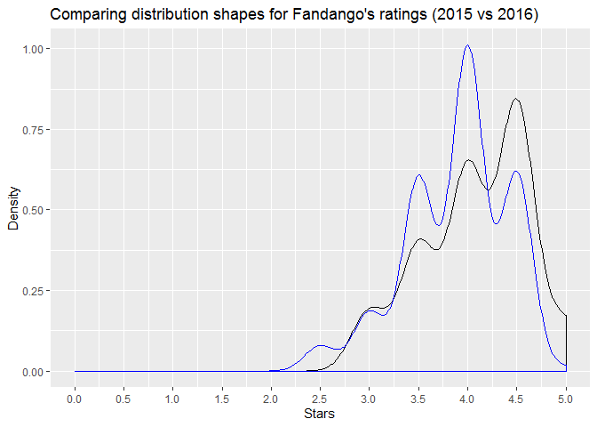
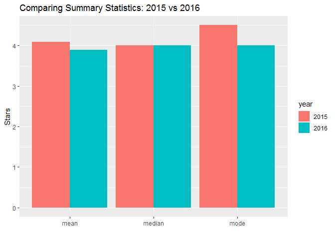

Investigating Fandango Movie Ratings
================

### Are Fandango’s ratings still inflated?

In October 2015, data journalist Walt Hickey analyzed Fandango’s movie
ratings and found strong evidence to suggest that their rating system
was biased and dishonest. [Fandango](https://www.fandango.com/) is an
online movie ratings aggregator. Hickey published his analysis in [this
article](https://fivethirtyeight.com/features/fandango-movies-ratings/).
The data he collected can be found
[here](https://github.com/fivethirtyeight/data/tree/master/fandango).

Fandango displays a 5-star rating system on their website where minimum
rating is 0 stars and maximum is 5 stars. The actual rating was almost
always rounded up to the nearest half-star. Fandango’s officials argued
that the biased rounding off was caused by a bug in their system rather
than being intentional and they promised to fix the bug. We can’t tell
if it was fixed, since the actual rating value doesn’t seem to be
displayed anymore in the pages’ HTML.

In this project, we’ll analyze more recent movie ratings data to
determine whether there has been any change in Fandango’s rating system
after Hickey’s analysis. The data can be found
[here](https://github.com/mircealex/Movie_ratings_2016_17).

### Exploring the data

``` r
library(readr)
fandango15 <- read_csv("fandango_score_comparison.csv")
```

    ## Parsed with column specification:
    ## cols(
    ##   .default = col_double(),
    ##   FILM = col_character()
    ## )

    ## See spec(...) for full column specifications.

``` r
fandango1617 <- read_csv("movie_ratings_16_17.csv")
```

    ## Parsed with column specification:
    ## cols(
    ##   movie = col_character(),
    ##   year = col_double(),
    ##   metascore = col_double(),
    ##   imdb = col_double(),
    ##   tmeter = col_double(),
    ##   audience = col_double(),
    ##   fandango = col_double(),
    ##   n_metascore = col_double(),
    ##   n_imdb = col_double(),
    ##   n_tmeter = col_double(),
    ##   n_audience = col_double(),
    ##   nr_metascore = col_double(),
    ##   nr_imdb = col_double(),
    ##   nr_tmeter = col_double(),
    ##   nr_audience = col_double()
    ## )

``` r
head(fandango15)
```

    ## # A tibble: 6 x 22
    ##   FILM  RottenTomatoes RottenTomatoes_~ Metacritic Metacritic_User  IMDB
    ##   <chr>          <dbl>            <dbl>      <dbl>           <dbl> <dbl>
    ## 1 Aven~             74               86         66             7.1   7.8
    ## 2 Cind~             85               80         67             7.5   7.1
    ## 3 Ant-~             80               90         64             8.1   7.8
    ## 4 Do Y~             18               84         22             4.7   5.4
    ## 5 Hot ~             14               28         29             3.4   5.1
    ## 6 The ~             63               62         50             6.8   7.2
    ## # ... with 16 more variables: Fandango_Stars <dbl>,
    ## #   Fandango_Ratingvalue <dbl>, RT_norm <dbl>, RT_user_norm <dbl>,
    ## #   Metacritic_norm <dbl>, Metacritic_user_nom <dbl>, IMDB_norm <dbl>,
    ## #   RT_norm_round <dbl>, RT_user_norm_round <dbl>,
    ## #   Metacritic_norm_round <dbl>, Metacritic_user_norm_round <dbl>,
    ## #   IMDB_norm_round <dbl>, Metacritic_user_vote_count <dbl>,
    ## #   IMDB_user_vote_count <dbl>, Fandango_votes <dbl>,
    ## #   Fandango_Difference <dbl>

``` r
head(fandango1617)
```

    ## # A tibble: 6 x 15
    ##   movie  year metascore  imdb tmeter audience fandango n_metascore n_imdb
    ##   <chr> <dbl>     <dbl> <dbl>  <dbl>    <dbl>    <dbl>       <dbl>  <dbl>
    ## 1 10 C~  2016        76   7.2     90       79      3.5        3.8    3.6 
    ## 2 13 H~  2016        48   7.3     50       83      4.5        2.4    3.65
    ## 3 A Cu~  2016        47   6.6     40       47      3          2.35   3.3 
    ## 4 A Do~  2017        43   5.2     33       76      4.5        2.15   2.6 
    ## 5 A Ho~  2016        58   6.1     70       57      3          2.9    3.05
    ## 6 A Mo~  2016        76   7.5     87       84      4          3.8    3.75
    ## # ... with 6 more variables: n_tmeter <dbl>, n_audience <dbl>,
    ## #   nr_metascore <dbl>, nr_imdb <dbl>, nr_tmeter <dbl>, nr_audience <dbl>

Relevant columns for further use:

``` r
library(dplyr)
```

    ## 
    ## Attaching package: 'dplyr'

    ## The following objects are masked from 'package:stats':
    ## 
    ##     filter, lag

    ## The following objects are masked from 'package:base':
    ## 
    ##     intersect, setdiff, setequal, union

``` r
fandango_original <- fandango15 %>% select(FILM, Fandango_Stars, Fandango_Ratingvalue, Fandango_votes, Fandango_Difference)
fandango_new <- fandango1617 %>% select(movie, year, fandango)
```

``` r
head(fandango_original)
```

    ## # A tibble: 6 x 5
    ##   FILM      Fandango_Stars Fandango_Rating~ Fandango_votes Fandango_Differ~
    ##   <chr>              <dbl>            <dbl>          <dbl>            <dbl>
    ## 1 Avengers~            5                4.5          14846              0.5
    ## 2 Cinderel~            5                4.5          12640              0.5
    ## 3 Ant-Man ~            5                4.5          12055              0.5
    ## 4 Do You B~            5                4.5           1793              0.5
    ## 5 Hot Tub ~            3.5              3             1021              0.5
    ## 6 The Wate~            4.5              4              397              0.5

``` r
head(fandango_new)
```

    ## # A tibble: 6 x 3
    ##   movie                    year fandango
    ##   <chr>                   <dbl>    <dbl>
    ## 1 10 Cloverfield Lane      2016      3.5
    ## 2 13 Hours                 2016      4.5
    ## 3 A Cure for Wellness      2016      3  
    ## 4 A Dog's Purpose          2017      4.5
    ## 5 A Hologram for the King  2016      3  
    ## 6 A Monster Calls          2016      4

We have to figure out whether the two samples are representative for the
population we are trying to describe.

According to [Hickey’s
article](https://fivethirtyeight.com/features/fandango-movies-ratings/),
he pulled data on August 24th, 2015 on Fandango.com for 510 films that
had tickets on sale that year. He also focused on movies that had 30 or
more user reviews. The terms are also stated in the README.md of
Hickey’s data (`fandango_score_comparison.csv`) which can be found
[here](https://github.com/fivethirtyeight/data/blob/master/fandango/README.md).
The sampling was obviously not random.

For more recent movie ratings, the README.md can be found
[here](https://github.com/mircealex/Movie_ratings_2016_17/blob/master/README.md).
The data (`movie_ratings_16_17.csv`) contains movie ratings for 214 of
the most popular movies released in 2016 and 2017, with a significant
number of votes (not specified how many). The ratings were up to date as
of March 22, 2017. Sampling in this data set was also not random.

In both cases, the two samples are unlikely to be representative of the
population we are trying to describe, because both consider a certain
time frame and additional terms that do not represent random sampling.
All movies did not have an equal chance to be included in the two
samples.

At this point, we can collect new data or we can change the goal of our
analysis. Due to the fact that we cannot collect new data for our
purposes at this moment, we will change the current goal of our
analysis.

### Changing the goal of the analysis

Instead of determining whether there has been any change in Fandango’s
rating system, we can try to determine if there is any difference in
rating between the movies that were popular both in 2015 and 2016. Our
new goal is still a fairly good proxy for our initial goal.

### Isolating the samples we need

With the new goal, we have two populations that we want to describe and
compare:

  - all Fandango’s ratings for popular movies released in 2015
  - all Fandango’s ratings for popular movies released in 2016

To define the term “popular”, we will use Hickey’s benchmark of 30 fan
ratings.

First we have to check if both samples contain popular movies: the
original data uses the 30 ratings benchmark, but we have to check the
more recent data.

Since the more recent data doesn’t contain the information about the
number of fan ratings, this raises the representativity issues once
again. A quick way to check whether this sample contains enough popular
movies to be representative is to sample randomly 10 movies and find the
number of fan ratings for those on Fandango’s website.

``` r
set.seed(1)
sample_n(fandango_new, size = 10)
```

    ## # A tibble: 10 x 3
    ##    movie                     year fandango
    ##    <chr>                    <dbl>    <dbl>
    ##  1 Hands of Stone            2016      4  
    ##  2 The Bye Bye Man           2017      3  
    ##  3 Our Kind of Traitor       2016      3.5
    ##  4 The Autopsy of Jane Doe   2016      4.5
    ##  5 Dirty Grandpa             2016      3.5
    ##  6 Arsenal                   2017      3.5
    ##  7 The Light Between Oceans  2016      4  
    ##  8 Exposed                   2016      2.5
    ##  9 Jason Bourne              2016      4  
    ## 10 Before I Fall             2017      3.5

Value of 1 as the random seed is good practice because it suggests that
we weren’t trying out various random seeds just to get a favorable
sample.

Search on Fandango’s website shows that Fandango uses scores from Rotten
Tomatoes instead of 5-Star Fan Rating (as checked in September 2019).
More about the Rotten Tomatoes verified Audience Score can be found
[here](https://editorial.rottentomatoes.com/article/introducing-verified-audience-score/).

These are the number of fan ratings found on [Rotten
Tomatoes](https://www.rottentomatoes.com/):

  - Hands of Stone - 5255
  - The Bye Bye Man - 7195
  - Our Kind of Traitor - 7244
  - The Autopsy of Jane Doe - 11975
  - Dirty Grandpa - 30193
  - Arsenal - 274
  - The Light Between Oceans - 13649
  - Exposed - 1200
  - Jason Bourne - 56724
  - Before I Fall - 9163

We can add the ratings to our sample:

``` r
set.seed(1)
sampled <- sample_n(fandango_new, size = 10)
reviews <- tibble(reviews = c(5255, 7195, 7244, 11975, 30193, 274, 13649, 1200, 56724, 9163))
bind_cols(sampled, reviews)
```

    ## # A tibble: 10 x 4
    ##    movie                     year fandango reviews
    ##    <chr>                    <dbl>    <dbl>   <dbl>
    ##  1 Hands of Stone            2016      4      5255
    ##  2 The Bye Bye Man           2017      3      7195
    ##  3 Our Kind of Traitor       2016      3.5    7244
    ##  4 The Autopsy of Jane Doe   2016      4.5   11975
    ##  5 Dirty Grandpa             2016      3.5   30193
    ##  6 Arsenal                   2017      3.5     274
    ##  7 The Light Between Oceans  2016      4     13649
    ##  8 Exposed                   2016      2.5    1200
    ##  9 Jason Bourne              2016      4     56724
    ## 10 Before I Fall             2017      3.5    9163

Every movie in our sample has more than 30 reviews. But Rotten Tomatoes
user base could be larger then the Fandango user base. Also, time has
passed since Hickey’s original analysis, giving more users a chance to
submit ratings, which is the reason why Fandango’s 5-star rating
wouldn’t be of use to us if it was still available.

We can also check the original sample:

``` r
sum(fandango_original$Fandango_votes<30)
```

    ## [1] 0

We can explore the data some more and check the years of the
    movies.

``` r
head(fandango_original$FILM, n = 10)
```

    ##  [1] "Avengers: Age of Ultron (2015)" "Cinderella (2015)"             
    ##  [3] "Ant-Man (2015)"                 "Do You Believe? (2015)"        
    ##  [5] "Hot Tub Time Machine 2 (2015)"  "The Water Diviner (2015)"      
    ##  [7] "Irrational Man (2015)"          "Top Five (2014)"               
    ##  [9] "Shaun the Sheep Movie (2015)"   "Love & Mercy (2015)"

``` r
library(stringr)
pattern <- "(\\(\\w+\\))"
matches <- str_match(fandango_original$FILM, pattern)
years_original <- matches[,2]
unique(years_original)
```

    ## [1] "(2015)" "(2014)"

In the original data, we have movies released in 2014 and 2015.

To check the new data:

``` r
unique(fandango_new$year)
```

    ## [1] 2016 2017

In the new data, we have movies released in 2016 and 2017.

We need only movies released in 2015 and 2016 for our analysis.

To get a quick view of the distribution per year:

``` r
fandango_original <- fandango_original %>%
  mutate(year = str_sub(FILM, -5, -2))
```

``` r
table(fandango_original$year)
```

    ## 
    ## 2014 2015 
    ##   17  129

Filter the first data set:

``` r
fandango_2015 <- fandango_original %>%
  filter(year == 2015)
table(fandango_2015$year)
```

    ## 
    ## 2015 
    ##  129

Check and filter the second data set:

``` r
table(fandango_new$year)
```

    ## 
    ## 2016 2017 
    ##  191   23

``` r
fandango_2016 <- fandango_new %>%
  filter(year == 2016)
table(fandango_2016$year)
```

    ## 
    ## 2016 
    ##  191

### Comparing distribution shapes for 2015 and 2016

To find out if there’s any difference between Fandango’s ratings for
popular movies in 2015 and Fandango’s ratings for popular movies in
2016, we’ll start by generating two kernel density plots for the
distribution of movie ratings of each sample.

``` r
library(ggplot2)
ggplot(data = fandango_2015,
       aes(x= Fandango_Stars))+
  geom_density()+
  geom_density(data = fandango_2016,
               aes(x=fandango), color = "blue") +
  labs(title = "Comparing distribution shapes for Fandango's ratings (2015 vs 2016)",
       x = "Stars",
       y = "Density") +
  scale_x_continuous(breaks = seq(0, 5, by = 0.5), 
                     limits = c(0, 5))
```

<!-- -->

Both distributions are left-skewed.The distribution for 2016 is shifted
to the left relative to 2015 distribution. The 2015 distribution
increases to the maximum of 4.5 and then drops. The 2016 distribution is
relatively symmetrical from 3.25 to 4.75 with the maximum at 4.0.

The left skew suggests that movies on Fandango are given mostly high and
very high fan ratings.

The shift of the 2016 distribution to the left shows that ratings
changed in 2016 compared to 2015. We can also see the direction of the
difference: the ratings in 2016 were slightly lower compared to 2015.

### Comparing relative frequencies

To analyze more granular information, we can take a look at the
frequency distribution tables of the two distributions.

Since our samples have a different number of movies, absolute
frequencies are not useful here, so we will use relative frequencies:

``` r
fandango_2015 %>%
  group_by(Fandango_Stars) %>%
  summarize(Percentage = n() / nrow(fandango_2015) * 100)
```

    ## # A tibble: 5 x 2
    ##   Fandango_Stars Percentage
    ##            <dbl>      <dbl>
    ## 1            3         8.53
    ## 2            3.5      17.8 
    ## 3            4        28.7 
    ## 4            4.5      38.0 
    ## 5            5         6.98

``` r
fandango_2016 %>%
  group_by(fandango) %>%
  summarize(Percentage = n() / nrow(fandango_2016) * 100)
```

    ## # A tibble: 6 x 2
    ##   fandango Percentage
    ##      <dbl>      <dbl>
    ## 1      2.5      3.14 
    ## 2      3        7.33 
    ## 3      3.5     24.1  
    ## 4      4       40.3  
    ## 5      4.5     24.6  
    ## 6      5        0.524

When we compare the frequency distributions, there is significantly less
5.0 star (drop from 6.98% to 0.52%) and 4.5 star (drop from 37.98% to
24.61%) ratings in 2016, but there is a rise in 4.0 ratings (from 28.68%
to 40.31%) and 3.5 ratings (from 17.82% to 24.08%). Number of 3.0
ratings is slightly lower in 2016 and there is also a rating of 2.5 that
is absent from 2015 distribution.

There is a difference between two distributions but the direction is not
that clear anymore.

### Determining the direction of change

To get a more precise picture about the direction of the difference we
can take a look at mean, median and mode.

We’ll use a mode function from [this stackowerflow
post](https://stackoverflow.com/questions/2547402/is-there-a-built-in-function-for-finding-the-mode):

``` r
mode <- function(x) {
  ux <- unique(x)
  ux[which.max(tabulate(match(x, ux)))]
}
```

``` r
summary_2015 <- fandango_2015 %>% 
  summarize(year = "2015",
    mean = mean(Fandango_Stars),
    median = median(Fandango_Stars),
    mode = mode(Fandango_Stars))
```

``` r
summary_2016 <- fandango_2016 %>% 
  summarize(year = "2016",
            mean = mean(fandango),
            median = median(fandango),
            mode = mode(fandango))
```

We can combine the 2015 and 2016 summary and gather the combined
dataframe for visualization.

``` r
library(tidyr)
summary <- bind_rows(summary_2015, summary_2016)
summary <- summary %>%
  gather(key = "statistic", value = "value", - year)
summary
```

    ## # A tibble: 6 x 3
    ##   year  statistic value
    ##   <chr> <chr>     <dbl>
    ## 1 2015  mean       4.09
    ## 2 2016  mean       3.89
    ## 3 2015  median     4   
    ## 4 2016  median     4   
    ## 5 2015  mode       4.5 
    ## 6 2016  mode       4

``` r
ggplot(data = summary, aes(x = statistic, y = value, fill = year)) +
  geom_bar(stat = "identity", position = "dodge") +
  labs(title = "Comparing Summary Statistics: 2015 vs 2016",
       x = "",
       y = "Stars")
```

<!-- -->

Median is same for both samples. Mean is lower in 2016 (from 4.09 to
3.89). Mode is lower in 2016 (from 4.5 to 4).

``` r
means <- summary %>% 
  filter(statistic == "mean")
means %>% 
  summarize(change = (value[1] - value[2]) / value[1])
```

    ## # A tibble: 1 x 1
    ##   change
    ##    <dbl>
    ## 1 0.0484

``` r
modes <- summary %>% 
  filter(statistic == "mode")
modes %>% 
  summarize(change = (value[1] - value[2]) / value[1])
```

    ## # A tibble: 1 x 1
    ##   change
    ##    <dbl>
    ## 1  0.111

Due to the 5% median drop and 11% mode drop we can confirm the direction
of change observed in the kernel density plot. On average, popular
movies released in 2016 were rated slightly lower than popular movies
released in 2015.

### Conclusion

The analysis showed that there is small difference between Fandango’s
movies ratings in 2015 and Fandango’s movies ratings in 2016 for popular
movies. Popular movies released in 2016 were rated lower than the
popular movies released in 2015, on average.

Although we cannot with certainty conclude on the cause of the change,
it is probable that Fandango changed their rating system after Hickey’s
article was published.
